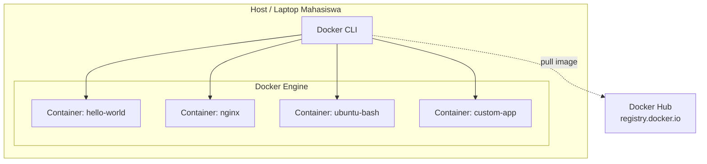

# MODUL 1: Docker dan Instalasi

**Topik:** Pengenalan Docker, Arsitektur Container, dan Instalasi di Linux & Windows  
**Durasi:** 120 menit  
**Prasyarat:** Familiar dengan Linux CLI dasar, memahami konsep virtualisasi

---

## 1. TUJUAN PEMBELAJARAN

Setelah praktikum ini, mahasiswa mampu:

1. Menjelaskan perbedaan mendasar antara virtualisasi tradisional (VM) dan containerization
2. Memahami arsitektur Docker: Docker Engine, Docker Daemon, Docker CLI, dan Docker Registry
3. Menginstal Docker Engine di Ubuntu 22.04 menggunakan repository resmi
4. Menginstal Docker Desktop di Windows 10/11 dengan WSL2 backend
5. Menjalankan container pertama (`hello-world`, `nginx`, `ubuntu`) dan memahami lifecycle container
6. Menggunakan perintah dasar Docker: `run`, `ps`, `stop`, `rm`, `images`, `pull`, `exec`, `logs`
7. Memahami konsep Docker Image, Layer, dan Docker Hub sebagai registry publik
8. Menulis Dockerfile sederhana dan melakukan build image custom

---

## 2. DASAR TEORI

### 2.1 Virtualisasi vs Containerization

| Aspek | Virtual Machine (VM) | Container (Docker) |
|---|---|---|
| Isolasi | Full OS per instance | Shared kernel, isolated userspace |
| Ukuran | GB (include guest OS) | MB (hanya app + dependencies) |
| Startup | Menit | Detik |
| Overhead | Tinggi (hypervisor + guest OS) | Rendah (langsung di host kernel) |
| Portabilitas | Image besar, format bervariasi | Image ringan, standar OCI |
| Use Case | Multi-OS, strong isolation | Microservices, CI/CD, scaling |

### 2.2 Arsitektur Docker

```
┌─────────────────────────────────────────────────┐
│                  Docker Client                   │
│              (docker CLI / Docker Desktop)        │
└─────────────┬───────────────────────────────────┘
              │ REST API (unix socket / TCP)
┌─────────────▼───────────────────────────────────┐
│                  Docker Daemon (dockerd)          │
│  ┌──────────┐  ┌──────────┐  ┌───────────────┐  │
│  │ Images   │  │Containers│  │   Networks     │  │
│  └──────────┘  └──────────┘  └───────────────┘  │
│  ┌──────────┐  ┌──────────────────────────────┐  │
│  │ Volumes  │  │   containerd + runc (OCI)    │  │
│  └──────────┘  └──────────────────────────────┘  │
└─────────────────────────────────────────────────┘
              │
┌─────────────▼───────────────────────────────────┐
│              Host OS Kernel (Linux)               │
│    namespaces | cgroups | union filesystem        │
└─────────────────────────────────────────────────┘
```

**Komponen utama:**

- **Docker Client (`docker`):** CLI yang mengirim perintah ke Docker Daemon melalui REST API
- **Docker Daemon (`dockerd`):** Background service yang mengelola image, container, network, dan volume
- **containerd:** Container runtime yang mengelola lifecycle container
- **runc:** Low-level runtime yang membuat dan menjalankan container sesuai spesifikasi OCI
- **Docker Registry:** Tempat penyimpanan image (Docker Hub, GitHub Container Registry, private registry)

### 2.3 Konsep Image dan Layer

Docker Image dibangun secara berlapis (layered filesystem). Setiap instruksi di Dockerfile menghasilkan satu layer. Layer bersifat **read-only** dan di-**share** antar image yang memiliki base sama, menghemat disk dan bandwidth.

```
┌──────────────────────────┐
│  Layer 4: COPY app.py    │  ← Writable (container layer)
├──────────────────────────┤
│  Layer 3: RUN pip install│  ← Read-only
├──────────────────────────┤
│  Layer 2: RUN apt update │  ← Read-only
├──────────────────────────┤
│  Layer 1: ubuntu:22.04   │  ← Base image (read-only)
└──────────────────────────┘
```

### 2.4 Container Lifecycle

```
          docker create
  Image ──────────────► Created
                           │
                    docker start
                           │
                           ▼
                        Running ◄──── docker restart
                        │    │
              docker stop│    │ docker pause
                        │    ▼
                        │  Paused
                        │    │
                        │    │ docker unpause
                        │    │
                        ▼    ▼
                       Stopped
                           │
                    docker rm
                           │
                           ▼
                       Removed
```

### 2.5 Docker di Windows: WSL2 Backend

Docker Desktop di Windows menggunakan **WSL2 (Windows Subsystem for Linux 2)** sebagai backend. WSL2 menjalankan kernel Linux asli di dalam lightweight VM yang dikelola Windows, sehingga Docker container berjalan secara native di kernel Linux tanpa overhead emulasi.

---

## 3. TOPOLOGI LAB



---

## 4. LANGKAH PRAKTIKUM

### Langkah 0: Persiapan Environment

**Pastikan VM/Host sudah terkoneksi internet** untuk download image dari Docker Hub.

```bash
# Cek koneksi internet
ping -c 3 google.com

# Update package list
sudo apt update && sudo apt upgrade -y
```

---

### Langkah 1: Instalasi Docker Engine di Ubuntu 22.04

#### 1.1 Hapus versi lama (jika ada)

```bash
# Hapus package Docker versi lama yang mungkin terinstal
sudo apt remove -y docker docker-engine docker.io containerd runc 2>/dev/null
```

#### 1.2 Instal dependensi

```bash
sudo apt install -y \
    ca-certificates \
    curl \
    gnupg \
    lsb-release
```

#### 1.3 Tambahkan Docker GPG key dan repository

```bash
# Buat direktori keyrings
sudo install -m 0755 -d /etc/apt/keyrings

# Download GPG key Docker
curl -fsSL https://download.docker.com/linux/ubuntu/gpg | \
    sudo gpg --dearmor -o /etc/apt/keyrings/docker.gpg

sudo chmod a+r /etc/apt/keyrings/docker.gpg

# Tambahkan repository Docker
echo \
  "deb [arch=$(dpkg --print-architecture) signed-by=/etc/apt/keyrings/docker.gpg] \
  https://download.docker.com/linux/ubuntu \
  $(lsb_release -cs) stable" | \
  sudo tee /etc/apt/sources.list.d/docker.list > /dev/null
```

#### 1.4 Instal Docker Engine

```bash
sudo apt update

sudo apt install -y \
    docker-ce \
    docker-ce-cli \
    containerd.io \
    docker-buildx-plugin \
    docker-compose-plugin
```

#### 1.5 Konfigurasi user non-root

```bash
# Tambahkan user saat ini ke group docker
sudo usermod -aG docker $USER

# Aktifkan group baru (atau logout/login)
newgrp docker
```

#### 1.6 Verifikasi instalasi

```bash
# Cek versi Docker
docker version

# Cek info Docker Engine
docker info

# Pastikan service berjalan
sudo systemctl status docker

# Test container pertama
docker run hello-world
```

**Expected output `docker run hello-world`:**
```
Hello from Docker!
This message shows that your installation appears to be working correctly.
...
```

---

### Langkah 2: Instalasi Docker Desktop di Windows 10/11

> **Catatan:** Langkah ini dilakukan di laptop/PC Windows sebagai referensi. Praktikum utama menggunakan Ubuntu.

#### 2.1 Aktifkan WSL2

Buka **PowerShell sebagai Administrator:**

```powershell
# Aktifkan WSL
wsl --install

# Set WSL2 sebagai default
wsl --set-default-version 2

# Verifikasi
wsl --list --verbose
```

Restart komputer jika diminta.

#### 2.2 Download dan Instal Docker Desktop

1. Buka https://www.docker.com/products/docker-desktop/
2. Download **Docker Desktop for Windows**
3. Jalankan installer, centang **"Use WSL 2 instead of Hyper-V"**
4. Klik **Install** → tunggu selesai → **Restart** jika diminta

#### 2.3 Konfigurasi Docker Desktop

1. Buka **Docker Desktop** dari Start Menu
2. Masuk ke **Settings → General** → pastikan **"Use the WSL 2 based engine"** aktif
3. Masuk ke **Settings → Resources → WSL Integration** → aktifkan distro yang diinginkan

#### 2.4 Verifikasi dari PowerShell / WSL Terminal

```powershell
# Dari PowerShell
docker version
docker run hello-world

# Dari WSL terminal (Ubuntu)
docker version
docker run hello-world
```

---

### Langkah 3: Operasi Dasar Docker Image

#### 3.1 Pull image dari Docker Hub

```bash
# Pull image nginx versi latest
docker pull nginx

# Pull image nginx versi spesifik
docker pull nginx:1.26

# Pull image Ubuntu 22.04
docker pull ubuntu:22.04

# Pull image Alpine (sangat ringan, ~7MB)
docker pull alpine:3.20
```

#### 3.2 Manajemen image

```bash
# List semua image lokal
docker images

# List dengan format custom
docker images --format "table {{.Repository}}\t{{.Tag}}\t{{.Size}}"

# Inspect detail image
docker image inspect nginx

# Lihat history layer sebuah image
docker image history nginx

# Hapus image
docker rmi alpine:3.20

# Hapus semua image yang tidak digunakan
docker image prune -a
```

---

### Langkah 4: Menjalankan dan Mengelola Container

#### 4.1 Menjalankan container dasar

```bash
# Jalankan container nginx (foreground — tekan Ctrl+C untuk stop)
docker run nginx

# Jalankan nginx di background (detached mode)
docker run -d --name web-server nginx

# Jalankan nginx dengan port mapping (host:container)
docker run -d --name web-public -p 8080:80 nginx
```

Buka browser ke `http://localhost:8080` → akan tampil halaman default Nginx.

#### 4.2 Container interaktif

```bash
# Jalankan Ubuntu container dengan bash interaktif
docker run -it --name ubuntu-test ubuntu:22.04 /bin/bash

# Di dalam container:
cat /etc/os-release
apt update && apt install -y curl
curl http://web-server    # akses container lain (jika di network sama)
exit                       # keluar (container akan stop)
```

#### 4.3 Monitoring container

```bash
# List container yang sedang berjalan
docker ps

# List SEMUA container (termasuk stopped)
docker ps -a

# Lihat log container
docker logs web-server
docker logs -f web-server    # follow (real-time)
docker logs --tail 20 web-server  # 20 baris terakhir

# Lihat resource usage (CPU, Memory, I/O)
docker stats

# Lihat detail container
docker inspect web-server
```

#### 4.4 Interaksi dengan container berjalan

```bash
# Eksekusi perintah di container yang sedang berjalan
docker exec web-server cat /etc/nginx/nginx.conf

# Masuk ke shell container yang sedang berjalan
docker exec -it web-server /bin/bash

# Copy file dari host ke container
docker cp index.html web-server:/usr/share/nginx/html/index.html

# Copy file dari container ke host
docker cp web-server:/etc/nginx/nginx.conf ./nginx.conf
```

#### 4.5 Lifecycle management

```bash
# Stop container
docker stop web-server

# Start container yang sudah di-stop
docker start web-server

# Restart container
docker restart web-server

# Kill container (force stop — SIGKILL)
docker kill web-server

# Hapus container (harus dalam keadaan stopped)
docker stop web-server && docker rm web-server

# Hapus container secara paksa (meskipun masih running)
docker rm -f web-server

# Hapus SEMUA stopped container
docker container prune
```

---

### Langkah 5: Membuat Custom Image dengan Dockerfile

#### 5.1 Buat project directory

```bash
mkdir -p ~/docker-lab/custom-web && cd ~/docker-lab/custom-web
```

#### 5.2 Buat halaman web

```bash
cat > index.html << 'EOF'
<!DOCTYPE html>
<html lang="id">
<head>
    <meta charset="UTF-8">
    <title>Docker Lab - PENS</title>
    <style>
        body { font-family: Arial, sans-serif; text-align: center; padding: 50px;
               background: linear-gradient(135deg, #667eea 0%, #764ba2 100%);
               color: white; }
        .container { background: rgba(255,255,255,0.1); border-radius: 15px;
                     padding: 40px; max-width: 600px; margin: 0 auto; }
        h1 { font-size: 2.5em; }
        .info { background: rgba(0,0,0,0.2); padding: 15px; border-radius: 8px;
                margin-top: 20px; text-align: left; }
    </style>
</head>
<body>
    <div class="container">
        <h1>🐳 Docker Lab PENS</h1>
        <p>Container berhasil berjalan!</p>
        <div class="info">
            <p><strong>Hostname:</strong> <span id="host"></span></p>
            <p><strong>Server:</strong> Nginx on Docker</p>
            <p><strong>Praktikum:</strong> Modul 1 — Instalasi Docker</p>
        </div>
    </div>
    <script>
        document.getElementById('host').textContent = location.hostname;
    </script>
</body>
</html>
EOF
```

#### 5.3 Buat Dockerfile

```bash
cat > Dockerfile << 'EOF'
# Gunakan base image nginx versi stabil
FROM nginx:1.26-alpine

# Metadata
LABEL maintainer="admin@pens.ac.id"
LABEL description="Custom Nginx untuk praktikum Docker PENS"
LABEL version="1.0"

# Hapus halaman default dan ganti dengan halaman custom
RUN rm -rf /usr/share/nginx/html/*
COPY index.html /usr/share/nginx/html/index.html

# Expose port 80
EXPOSE 80

# Command default (inherited dari base image, tapi kita tulis eksplisit)
CMD ["nginx", "-g", "daemon off;"]
EOF
```

#### 5.4 Build dan jalankan

```bash
# Build image (titik di akhir = build context = direktori saat ini)
docker build -t pens-web:1.0 .

# Verifikasi image berhasil dibuat
docker images | grep pens-web

# Jalankan container dari image custom
docker run -d --name pens-app -p 9090:80 pens-web:1.0

# Test
curl http://localhost:9090
```

Buka browser ke `http://localhost:9090`.

#### 5.5 Lihat layer image

```bash
# Bandingkan layer antara base image dan custom image
docker image history nginx:1.26-alpine
docker image history pens-web:1.0
```

---

### Langkah 6: Docker System Cleanup

```bash
# Lihat disk usage Docker
docker system df

# Lihat detail disk usage
docker system df -v

# Hapus semua resource yang tidak digunakan (container, image, network, cache)
docker system prune -a

# Konfirmasi dengan -f (force, tanpa prompt)
docker system prune -a -f
```

---

## 5. PERTANYAAN

### Pre-Lab (jawab sebelum praktikum)

1. Sebutkan minimal 3 perbedaan antara Virtual Machine dan Container.
2. Apa fungsi dari `containerd` dan `runc` dalam arsitektur Docker?
3. Mengapa Docker membutuhkan kernel Linux? Bagaimana Docker Desktop di Windows mengatasi hal ini?
4. Apa keuntungan layered filesystem pada Docker Image?
5. Jelaskan perbedaan antara `docker run` dan `docker exec`.

### Post-Lab (jawab setelah praktikum)

1. Bandingkan output `docker image history nginx` dengan `docker image history pens-web:1.0`. Layer mana saja yang di-share?
2. Apa yang terjadi pada data di dalam container setelah container dihapus dengan `docker rm`? Bagaimana solusinya?
3. Jelaskan perbedaan antara `EXPOSE` di Dockerfile dan flag `-p` pada `docker run`. Apakah `EXPOSE` cukup untuk membuat port dapat diakses dari host?
4. Mengapa menggunakan tag spesifik (misal `nginx:1.26`) lebih baik daripada `nginx:latest` untuk production?
5. Berapa ukuran image `alpine:3.20` dibanding `ubuntu:22.04`? Apa trade-off menggunakan Alpine?

---

## 6. CHECKLIST

- [ ] Docker Engine terinstal di Ubuntu 22.04 — `docker version` menampilkan Client dan Server
- [ ] Docker Daemon running — `sudo systemctl status docker` menampilkan **active (running)**
- [ ] User non-root bisa jalankan Docker — `docker ps` tanpa `sudo` tidak error
- [ ] `docker run hello-world` berhasil menampilkan pesan sukses
- [ ] `docker pull nginx` berhasil download image dari Docker Hub
- [ ] `docker images` menampilkan daftar image lokal
- [ ] Container nginx berjalan di background — `docker ps` menampilkan status **Up**
- [ ] Port mapping berfungsi — browser bisa akses `http://localhost:8080`
- [ ] Container interaktif Ubuntu — bisa `exec -it` dan jalankan perintah di dalam container
- [ ] `docker logs` menampilkan log container nginx
- [ ] `docker stats` menampilkan resource usage container
- [ ] Dockerfile berhasil di-build — `docker build` selesai tanpa error
- [ ] Custom image `pens-web:1.0` bisa dijalankan dan diakses di port 9090
- [ ] `docker system df` menampilkan disk usage Docker

---

## 7. TABEL TROUBLESHOOTING

| **Gejala** | **Kemungkinan Cause** | **Solusi** |
|---|---|---|
| `permission denied` saat jalankan `docker ps` | User belum masuk group `docker` | `sudo usermod -aG docker $USER && newgrp docker` |
| `Cannot connect to Docker daemon` | Docker service belum running | `sudo systemctl start docker && sudo systemctl enable docker` |
| `docker pull` timeout | Tidak ada koneksi internet atau DNS gagal | Cek `ping google.com`, cek `/etc/resolv.conf` |
| Port 8080 sudah digunakan | Service lain pakai port yang sama | Ganti port: `docker run -p 8888:80 nginx` atau stop service lain |
| `docker build` gagal di step `apt update` | DNS di dalam container gagal | Tambah `--dns 8.8.8.8` atau buat `/etc/docker/daemon.json` dengan DNS custom |
| Image `hello-world` gagal pull | Docker Hub registry unreachable | Cek proxy, firewall, atau gunakan mirror registry |
| Container langsung exit setelah `docker run` | Proses utama container selesai/crash | Cek log: `docker logs <container>`, pastikan CMD benar |
| `Conflict. The container name is already in use` | Nama container sudah ada (meski stopped) | `docker rm <nama>` dulu, atau gunakan nama berbeda |
| WSL2 tidak terinstall di Windows | Feature Windows belum diaktifkan | Jalankan `wsl --install` dari PowerShell Administrator |
| Docker Desktop Windows lambat | Resource WSL2 terlalu kecil | Edit `.wslconfig` di `%USERPROFILE%`, atur memory dan CPU |

---

## 8. FORMAT LAPORAN

Submit via LMS dalam **satu file PDF (max 5 halaman)**:

**Halaman 1: Cover & Data Mahasiswa**
- Judul: Laporan Praktikum Modul 1 — Docker dan Instalasi
- Nama / NRP
- Kelas dan Kelompok
- Tanggal praktikum

**Halaman 2–4: Screenshot Wajib (8 screenshot)**
1. `docker version` — versi Client dan Server
2. `sudo systemctl status docker` — service **active (running)**
3. `docker run hello-world` — pesan sukses lengkap
4. `docker images` — daftar image yang sudah di-pull
5. `docker ps` — container nginx berjalan dengan port mapping
6. Browser mengakses `http://localhost:8080` — halaman Nginx default
7. `docker build -t pens-web:1.0 .` — proses build berhasil (step terakhir)
8. Browser mengakses `http://localhost:9090` — halaman custom PENS

**Halaman 5: Jawaban Post-Lab**
- Jawaban 5 pertanyaan post-lab dengan analisis

---

## 9. REFERENSI

1. Docker, Inc. (2025). Docker Documentation — Get Started. https://docs.docker.com/get-started/
2. Docker, Inc. (2025). Install Docker Engine on Ubuntu. https://docs.docker.com/engine/install/ubuntu/
3. Docker, Inc. (2025). Docker Desktop for Windows — WSL2 Backend. https://docs.docker.com/desktop/wsl/
4. Docker, Inc. (2025). Dockerfile Reference. https://docs.docker.com/reference/dockerfile/
5. Open Container Initiative. (2025). OCI Runtime Specification. https://opencontainers.org/
6. Microsoft. (2025). Windows Subsystem for Linux Documentation. https://learn.microsoft.com/en-us/windows/wsl/

---

> **Durasi:** 120 menit | **Difficulty:** Beginner  
> **Next:** Modul 2 — Docker Service, Volume & Mount Point
