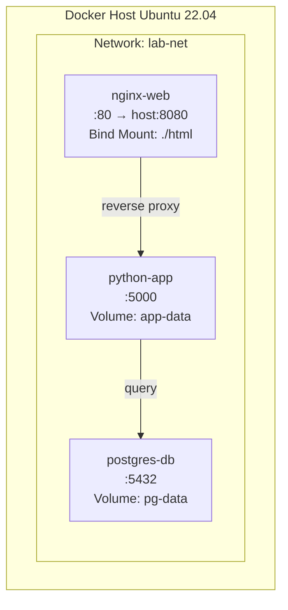

# MODUL 2: Docker Service, Volume & Mount Point

**Topik:** Docker Network, Docker Compose, Volume, Bind Mount, dan tmpfs Mount  
**Durasi:** 120 menit  
**Prasyarat:** Modul 1 selesai (Docker Engine terinstal dan berfungsi)

---

## 1. TUJUAN PEMBELAJARAN

Setelah praktikum ini, mahasiswa mampu:

1. Memahami dan mengelola Docker Network: bridge, host, dan none
2. Menghubungkan antar container menggunakan user-defined bridge network
3. Memahami perbedaan tiga jenis mount: **Volume**, **Bind Mount**, dan **tmpfs**
4. Membuat dan mengelola Docker Volume untuk persistensi data
5. Menggunakan Bind Mount untuk development workflow (live-reload)
6. Menginstal dan menggunakan Docker Compose untuk orkestrasi multi-container
7. Menulis file `docker-compose.yml` dengan definisi service, network, dan volume
8. Mengelola lifecycle aplikasi multi-container dengan `docker compose up/down/restart`

---

## 2. DASAR TEORI

### 2.1 Docker Network

Docker menyediakan beberapa driver network untuk menghubungkan container:

| Driver | Deskripsi | Use Case |
|---|---|---|
| `bridge` | Network default, container terisolasi dari host | Container standalone yang butuh komunikasi antar container |
| `host` | Container langsung pakai network host | Performa maksimal, tidak ada NAT overhead |
| `none` | Tidak ada network sama sekali | Container yang hanya butuh proses lokal |
| `overlay` | Multi-host networking | Docker Swarm / cluster |

**User-defined bridge** lebih unggul dari default bridge karena container bisa saling resolve by **nama** (automatic DNS), isolasi lebih baik, dan bisa di-connect/disconnect saat container running.

```
┌─────────────────────────────────────────────────┐
│              Host Machine                        │
│                                                  │
│  ┌─── bridge: app-net (172.20.0.0/16) ───────┐  │
│  │                                            │  │
│  │  ┌──────────┐       ┌──────────┐           │  │
│  │  │  web-app  │◄─────►│  db-app  │           │  │
│  │  │ 172.20.0.2│       │172.20.0.3│           │  │
│  │  └──────────┘       └──────────┘           │  │
│  └────────────────────────────────────────────┘  │
└─────────────────────────────────────────────────┘
```

### 2.2 Docker Mount: Volume vs Bind Mount vs tmpfs

Data di dalam container bersifat **ephemeral** — hilang saat container dihapus. Docker menyediakan tiga mekanisme mount untuk persistensi dan sharing data:

| Aspek | Volume | Bind Mount | tmpfs |
|---|---|---|---|
| Lokasi di host | `/var/lib/docker/volumes/` | Path bebas di host | RAM (memory) |
| Dikelola oleh | Docker Engine | User / OS | Kernel |
| Portabilitas | Tinggi (managed) | Rendah (path-dependent) | Tidak persisten |
| Permission | Docker handle | Bisa conflict UID/GID | Docker handle |
| Best for | Database, persistent data | Source code, config dev | Secrets, cache sementara |
| Syntax `-v` | `-v vol_name:/path` | `-v /host/path:/path` | `--tmpfs /path` |

### 2.3 Docker Compose

**Docker Compose** adalah tool untuk mendefinisikan dan menjalankan aplikasi multi-container menggunakan satu file YAML (`docker-compose.yml`). Keuntungan: satu file mendefinisikan seluruh stack, satu perintah untuk start/stop, environment reproducible dan version-controlled, serta dependency antar service otomatis dengan `depends_on`.

> **Catatan:** Gunakan `docker compose` (spasi, plugin v2) bukan `docker-compose` (hyphen, v1 standalone yang sudah deprecated).

---

## 3. TOPOLOGI LAB



---

## 4. LANGKAH PRAKTIKUM

### Langkah 1: Docker Network

#### 1.1 Eksplorasi network default

```bash
# List semua network Docker
docker network ls

# Inspect network bridge default
docker network inspect bridge
```

#### 1.2 Buat user-defined bridge network

```bash
docker network create --driver bridge --subnet 172.20.0.0/16 lab-net

# Verifikasi
docker network ls
docker network inspect lab-net
```

#### 1.3 Test DNS resolution antar container

```bash
# Jalankan 2 container di network yang sama
docker run -d --name server-a --network lab-net nginx:alpine
docker run -d --name server-b --network lab-net nginx:alpine

# Test DNS — container bisa saling resolve by nama
docker exec server-a ping -c 3 server-b
docker exec server-b ping -c 3 server-a

# Bandingkan: default bridge TIDAK bisa resolve nama
docker run -d --name server-c nginx:alpine
docker run -d --name server-d nginx:alpine
docker exec server-c ping -c 3 server-d   # GAGAL!
```

```bash
# Cleanup
docker rm -f server-a server-b server-c server-d
```

---

### Langkah 2: Docker Volume

#### 2.1 Buat dan kelola volume

```bash
docker volume create data-vol
docker volume ls
docker volume inspect data-vol
```

#### 2.2 Gunakan volume di container

```bash
# Container penulis — tulis timestamp ke volume setiap 5 detik
docker run -d --name writer \
    -v data-vol:/app/data \
    alpine:3.20 sh -c "while true; do date >> /app/data/log.txt; sleep 5; done"

# Tunggu 15 detik, lalu baca dari container BERBEDA
sleep 15
docker run --rm -v data-vol:/data alpine:3.20 cat /data/log.txt
```

#### 2.3 Volume persist setelah container dihapus

```bash
docker rm -f writer

# Data masih ada!
docker run --rm -v data-vol:/data alpine:3.20 cat /data/log.txt
```

#### 2.4 Backup dan restore volume

```bash
# BACKUP
docker run --rm \
    -v data-vol:/source:ro \
    -v $(pwd):/backup \
    alpine:3.20 tar czf /backup/data-vol-backup.tar.gz -C /source .

# RESTORE ke volume baru
docker volume create data-vol-restored
docker run --rm \
    -v data-vol-restored:/target \
    -v $(pwd):/backup:ro \
    alpine:3.20 tar xzf /backup/data-vol-backup.tar.gz -C /target

# Verifikasi
docker run --rm -v data-vol-restored:/data alpine:3.20 cat /data/log.txt
```

---

### Langkah 3: Bind Mount

#### 3.1 Buat project

```bash
mkdir -p ~/docker-lab/web-dev/html && cd ~/docker-lab/web-dev

cat > html/index.html << 'EOF'
<html>
<body>
    <h1>Hello dari Bind Mount!</h1>
    <p>Timestamp: VERSI-1</p>
</body>
</html>
EOF
```

#### 3.2 Jalankan container dengan bind mount

```bash
docker run -d --name dev-server \
    -p 8080:80 \
    -v $(pwd)/html:/usr/share/nginx/html:ro \
    nginx:alpine
```

#### 3.3 Test live-reload

```bash
curl http://localhost:8080

# Edit file di HOST → langsung terlihat di container tanpa restart!
sed -i 's/VERSI-1/VERSI-2 (diedit live)/' html/index.html
curl http://localhost:8080
```

```bash
docker rm -f dev-server
```

---

### Langkah 4: tmpfs Mount

```bash
docker run -d --name tmpfs-demo \
    --tmpfs /app/cache:size=64m \
    alpine:3.20 sh -c "echo 'secret-data' > /app/cache/token.txt && sleep 3600"

# Baca data
docker exec tmpfs-demo cat /app/cache/token.txt

# Stop & start → data HILANG
docker stop tmpfs-demo && docker start tmpfs-demo
docker exec tmpfs-demo cat /app/cache/token.txt   # File tidak ada!

docker rm -f tmpfs-demo
```

---

### Langkah 5: Aplikasi Multi-Container dengan Docker Compose

#### 5.1 Buat project structure

```bash
mkdir -p ~/docker-lab/compose-app/{html,app} && cd ~/docker-lab/compose-app
```

#### 5.2 Buat halaman Nginx

```bash
cat > html/index.html << 'EOF'
<!DOCTYPE html>
<html lang="id">
<head>
    <meta charset="UTF-8"><title>Docker Compose Lab</title>
    <style>
        body { font-family: sans-serif; max-width: 700px; margin: 40px auto; padding: 20px; }
        .card { background: white; border-radius: 10px; padding: 25px;
                box-shadow: 0 2px 10px rgba(0,0,0,0.1); margin-bottom: 20px; }
        #result { background: #263238; color: #80CBC4; padding: 15px;
                  border-radius: 8px; font-family: monospace; white-space: pre-wrap; }
    </style>
</head>
<body>
<div class="card">
    <h1>🐳 Docker Compose Lab</h1>
    <p>Nginx → Flask → PostgreSQL</p>
    <button onclick="fetchData()">Cek Koneksi Backend</button>
    <div id="result">Klik tombol untuk test...</div>
</div>
<script>
async function fetchData() {
    try {
        const r = await fetch('/api/health');
        document.getElementById('result').textContent = JSON.stringify(await r.json(), null, 2);
    } catch(e) { document.getElementById('result').textContent = 'Error: ' + e.message; }
}
</script>
</body></html>
EOF
```

#### 5.3 Buat Flask app + Dockerfile

```bash
cat > app/requirements.txt << 'EOF'
flask==3.1.*
psycopg2-binary==2.9.*
EOF

cat > app/app.py << 'PYEOF'
import os, socket, datetime
from flask import Flask, jsonify
import psycopg2

app = Flask(__name__)

@app.route("/api/health")
def health():
    result = {"status": "ok", "hostname": socket.gethostname(),
              "timestamp": datetime.datetime.now().isoformat()}
    try:
        conn = psycopg2.connect(
            host=os.environ.get("DB_HOST", "db"),
            dbname=os.environ.get("DB_NAME", "labdb"),
            user=os.environ.get("DB_USER", "labuser"),
            password=os.environ.get("DB_PASS", "labpass123"))
        cur = conn.cursor()
        cur.execute("SELECT version();")
        result["database"] = cur.fetchone()[0]
        result["db_status"] = "connected"
        cur.close(); conn.close()
    except Exception as e:
        result["db_status"] = f"error: {e}"
    return jsonify(result)

if __name__ == "__main__":
    app.run(host="0.0.0.0", port=5000)
PYEOF

cat > app/Dockerfile << 'EOF'
FROM python:3.11-slim
WORKDIR /app
COPY requirements.txt .
RUN pip install --no-cache-dir -r requirements.txt
COPY app.py .
EXPOSE 5000
CMD ["python", "app.py"]
EOF
```

#### 5.4 Buat Nginx config

```bash
cat > nginx.conf << 'EOF'
server {
    listen 80;
    location / {
        root /usr/share/nginx/html;
        index index.html;
    }
    location /api/ {
        proxy_pass http://app:5000;
        proxy_set_header Host $host;
        proxy_set_header X-Real-IP $remote_addr;
    }
}
EOF
```

#### 5.5 Buat `docker-compose.yml`

```bash
cat > docker-compose.yml << 'EOF'
services:
  web:
    image: nginx:alpine
    container_name: lab-web
    ports:
      - "8080:80"
    volumes:
      - ./html:/usr/share/nginx/html:ro
      - ./nginx.conf:/etc/nginx/conf.d/default.conf:ro
    networks:
      - frontend
    depends_on:
      - app
    restart: unless-stopped

  app:
    build: ./app
    container_name: lab-app
    environment:
      - DB_HOST=db
      - DB_NAME=labdb
      - DB_USER=labuser
      - DB_PASS=labpass123
    networks:
      - frontend
      - backend
    depends_on:
      db:
        condition: service_healthy
    restart: unless-stopped

  db:
    image: postgres:16-alpine
    container_name: lab-db
    environment:
      POSTGRES_DB: labdb
      POSTGRES_USER: labuser
      POSTGRES_PASSWORD: labpass123
    volumes:
      - pg-data:/var/lib/postgresql/data
    networks:
      - backend
    healthcheck:
      test: ["CMD-SHELL", "pg_isready -U labuser -d labdb"]
      interval: 5s
      timeout: 5s
      retries: 5
    restart: unless-stopped

volumes:
  pg-data:

networks:
  frontend:
  backend:
EOF
```

#### 5.6 Jalankan dan verifikasi

```bash
# Build dan start
docker compose up --build -d

# Cek status
docker compose ps

# Test
curl http://localhost:8080
curl http://localhost:8080/api/health | python3 -m json.tool

# Cek network dan volume
docker network ls
docker volume ls

# Lifecycle
docker compose logs -f          # follow log
docker compose stop             # stop semua
docker compose start            # start kembali
docker compose down             # stop + hapus container/network (volume tetap)
docker compose down -v          # HATI-HATI: hapus termasuk volume!
```

---

## 5. PERTANYAAN

### Pre-Lab

1. Apa perbedaan default bridge dan user-defined bridge network?
2. Kapan menggunakan Volume vs Bind Mount vs tmpfs?
3. Apa yang terjadi pada named volume saat `docker compose down`? Bagaimana jika pakai flag `-v`?
4. Apa fungsi `depends_on` dan `healthcheck` di `docker-compose.yml`?
5. Mengapa user-defined bridge bisa DNS resolve nama container, sedangkan default bridge tidak?

### Post-Lab

1. Jalankan `docker network inspect lab-frontend`. Sebutkan container dan IP masing-masing.
2. Hapus container `lab-db` lalu `docker compose up -d` lagi. Apakah data PostgreSQL masih ada? Mengapa?
3. Tunjukkan perbedaan output `docker inspect` untuk mount type `volume` vs `bind`.
4. Jelaskan alur request dari browser → Nginx → Flask → PostgreSQL.
5. Bandingkan ukuran image yang digunakan stack ini. Mana terbesar dan mengapa?

---

## 6. CHECKLIST

- [ ] User-defined bridge `lab-net` — dua container bisa ping by nama
- [ ] Default bridge — container **tidak** bisa resolve nama
- [ ] Named volume `data-vol` — data persist setelah container dihapus
- [ ] Volume backup/restore berhasil
- [ ] Bind mount — edit file di host langsung terlihat di container
- [ ] tmpfs — data hilang setelah container restart
- [ ] `docker compose up --build -d` — 3 service running
- [ ] `http://localhost:8080` menampilkan halaman web
- [ ] `http://localhost:8080/api/health` menampilkan database connected
- [ ] `docker compose down` berhasil cleanup

---

## 7. TABEL TROUBLESHOOTING

| **Gejala** | **Kemungkinan Cause** | **Solusi** |
|---|---|---|
| `docker compose: command not found` | Plugin v2 belum terinstal | `sudo apt install -y docker-compose-plugin` |
| Container `app` restart terus | Database belum ready | Pastikan `depends_on` + `healthcheck` ada |
| Nginx 502 Bad Gateway | Flask belum running | `docker compose logs app` — cek error |
| Bind mount `Permission denied` | UID/GID mismatch | Sesuaikan permission atau tambah `:z` |
| Volume data hilang setelah `down` | Menggunakan flag `-v` | Jangan pakai `-v` kecuali reset total |
| Port conflict | Port sudah dipakai service lain | Ganti port di compose file |
| DNS resolution gagal | Container di default bridge | Pindah ke user-defined bridge |
| `connection refused` ke database | Network berbeda atau db down | Cek `docker compose ps`, pastikan satu network |

---

## 8. FORMAT LAPORAN

Submit via LMS dalam **satu file PDF (max 6 halaman)**:

**Halaman 1:** Cover — Judul, Nama/NRP, Kelas, Kelompok, Tanggal

**Halaman 2–4:** Screenshot Wajib (10 screenshot):
1. `docker network ls` 2. ping antar container by nama 3. `docker volume ls` + inspect 4. Volume sharing antar container 5. Bind mount live-reload (sebelum/sesudah edit) 6. tmpfs inspect 7. `docker compose ps` 8. Browser halaman web 9. `curl /api/health` response 10. `docker compose down`

**Halaman 5–6:** Jawaban Post-Lab

---

## 9. REFERENSI

1. Docker, Inc. (2025). Docker Networking Overview. https://docs.docker.com/network/
2. Docker, Inc. (2025). Manage Data in Docker — Volumes. https://docs.docker.com/storage/volumes/
3. Docker, Inc. (2025). Manage Data in Docker — Bind Mounts. https://docs.docker.com/storage/bind-mounts/
4. Docker, Inc. (2025). Docker Compose Overview. https://docs.docker.com/compose/
5. Docker, Inc. (2025). Compose File Reference. https://docs.docker.com/compose/compose-file/

---

> **Durasi:** 120 menit | **Difficulty:** Beginner–Intermediate  
> **Previous:** Modul 1 — Docker dan Instalasi  
> **Next:** Modul 3 — Web Service di Docker (Apache & Nginx)
