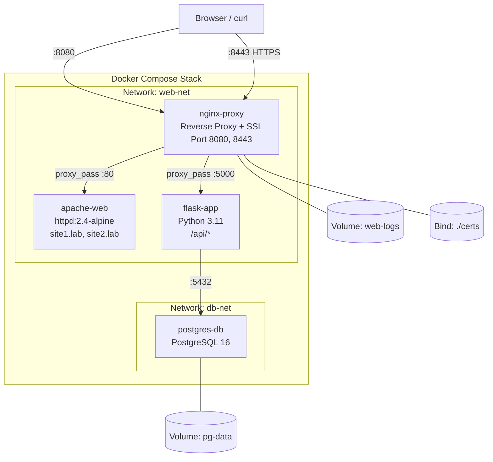

# MODUL 3: Web Service di Docker — Apache & Nginx

**Topik:** Deployment Apache2 dan Nginx sebagai Web Server di Docker dengan Custom Config, Virtual Host, SSL, dan Reverse Proxy  
**Durasi:** 120 menit  
**Prasyarat:** Modul 2 selesai (memahami Docker Compose, Volume, dan Network)

---

## 1. TUJUAN PEMBELAJARAN

Setelah praktikum ini, mahasiswa mampu:

1. Men-deploy Apache2 (httpd) sebagai container Docker dengan konfigurasi custom
2. Men-deploy Nginx sebagai container Docker dengan konfigurasi custom
3. Membuat Virtual Host (name-based) di Apache dan Nginx dalam container
4. Mengkonfigurasi SSL/TLS dengan self-signed certificate pada web server container
5. Menggunakan Nginx sebagai reverse proxy untuk backend service di container lain
6. Membandingkan konfigurasi dan performa Apache vs Nginx dalam konteks container
7. Mengatur persistent logging dengan bind mount / volume
8. Mengorkestrasi seluruh stack menggunakan Docker Compose

---

## 2. DASAR TEORI

### 2.1 Web Server dalam Container

Menjalankan web server di container memberikan beberapa keuntungan: isolasi konfigurasi antar project, kemudahan scaling, reproducible environment, dan deployment yang konsisten. Image resmi Apache (`httpd`) dan Nginx (`nginx`) tersedia di Docker Hub dengan berbagai variant (alpine, debian, dll).

### 2.2 Apache vs Nginx di Docker

| Aspek | Apache (httpd) | Nginx |
|---|---|---|
| Image resmi | `httpd:2.4-alpine` | `nginx:alpine` |
| Config dir | `/usr/local/apache2/conf/` | `/etc/nginx/` |
| Document root | `/usr/local/apache2/htdocs/` | `/usr/share/nginx/html/` |
| Virtual host | `httpd-vhosts.conf` | `conf.d/*.conf` |
| Arsitektur | Process/thread per request | Event-driven, async |
| Module system | `.so` modules, `.htaccess` | Compiled modules |
| Reverse proxy | `mod_proxy` | `proxy_pass` built-in |
| Ukuran image (alpine) | ~60 MB | ~45 MB |

### 2.3 Arsitektur Lab

```
                         Internet / Host
                              │
                         port 80/443
                              │
                    ┌─────────▼──────────┐
                    │   Nginx (Reverse   │
                    │   Proxy + SSL)     │
                    │   Container: proxy │
                    └──────┬───────┬─────┘
                           │       │
              ┌────────────▼─┐  ┌──▼──────────┐
              │  Apache Site │  │  Flask App   │
              │  Container:  │  │  Container:  │
              │  apache-web  │  │  flask-app   │
              └──────────────┘  └──────────────┘
                                       │
                              ┌────────▼────────┐
                              │   PostgreSQL    │
                              │  Container: db  │
                              └─────────────────┘
```

---

## 3. TOPOLOGI LAB



---

## 4. LANGKAH PRAKTIKUM

### Langkah 0: Persiapan Project

```bash
mkdir -p ~/docker-lab/web-service/{apache/{sites,html-site1,html-site2},nginx,flask,certs,logs}
cd ~/docker-lab/web-service
```

---

### Langkah 1: Konfigurasi Apache2 dengan Virtual Host

#### 1.1 Buat halaman web untuk dua virtual host

```bash
# Site 1: Company Profile
cat > apache/html-site1/index.html << 'EOF'
<!DOCTYPE html>
<html lang="id">
<head><meta charset="UTF-8"><title>Site 1 - Company</title>
<style>body{font-family:sans-serif;text-align:center;padding:50px;background:#1a237e;color:white;}
.box{background:rgba(255,255,255,0.1);padding:30px;border-radius:12px;max-width:500px;margin:0 auto;}</style>
</head>
<body><div class="box">
<h1>🏢 Site 1 — Company Profile</h1>
<p>Virtual Host: <strong>site1.lab</strong></p>
<p>Server: Apache httpd di Docker</p>
</div></body></html>
EOF

# Site 2: Blog
cat > apache/html-site2/index.html << 'EOF'
<!DOCTYPE html>
<html lang="id">
<head><meta charset="UTF-8"><title>Site 2 - Blog</title>
<style>body{font-family:sans-serif;text-align:center;padding:50px;background:#1b5e20;color:white;}
.box{background:rgba(255,255,255,0.1);padding:30px;border-radius:12px;max-width:500px;margin:0 auto;}</style>
</head>
<body><div class="box">
<h1>📝 Site 2 — Blog</h1>
<p>Virtual Host: <strong>site2.lab</strong></p>
<p>Server: Apache httpd di Docker</p>
</div></body></html>
EOF
```

#### 1.2 Buat konfigurasi Apache Virtual Host

```bash
cat > apache/sites/vhosts.conf << 'EOF'
# ============================================
# Apache Virtual Host Configuration (Docker)
# ============================================

# --- Site 1: site1.lab ---
<VirtualHost *:80>
    ServerName site1.lab
    ServerAlias www.site1.lab
    DocumentRoot /usr/local/apache2/htdocs/site1

    <Directory /usr/local/apache2/htdocs/site1>
        AllowOverride None
        Require all granted
    </Directory>

    # Per-site logging
    ErrorLog /var/log/apache2/site1-error.log
    CustomLog /var/log/apache2/site1-access.log combined
</VirtualHost>

# --- Site 2: site2.lab ---
<VirtualHost *:80>
    ServerName site2.lab
    ServerAlias www.site2.lab
    DocumentRoot /usr/local/apache2/htdocs/site2

    <Directory /usr/local/apache2/htdocs/site2>
        AllowOverride None
        Require all granted
    </Directory>

    ErrorLog /var/log/apache2/site2-error.log
    CustomLog /var/log/apache2/site2-access.log combined
</VirtualHost>
EOF
```

#### 1.3 Buat Dockerfile Apache

```bash
cat > apache/Dockerfile << 'EOF'
FROM httpd:2.4-alpine

# Aktifkan module yang dibutuhkan
RUN sed -i \
    -e 's/#LoadModule vhost_alias_module/LoadModule vhost_alias_module/' \
    -e 's/#LoadModule rewrite_module/LoadModule rewrite_module/' \
    /usr/local/apache2/conf/httpd.conf

# Include virtual host config
RUN echo "Include conf/extra/vhosts.conf" >> /usr/local/apache2/conf/httpd.conf

# Buat direktori log
RUN mkdir -p /var/log/apache2

# Copy virtual host config
COPY sites/vhosts.conf /usr/local/apache2/conf/extra/vhosts.conf

# Copy site files
COPY html-site1/ /usr/local/apache2/htdocs/site1/
COPY html-site2/ /usr/local/apache2/htdocs/site2/

EXPOSE 80
EOF
```

---

### Langkah 2: Generate Self-Signed SSL Certificate

```bash
# Generate SSL certificate untuk *.lab (wildcard)
openssl req -x509 -nodes -days 365 \
    -newkey rsa:2048 \
    -keyout certs/server.key \
    -out certs/server.crt \
    -subj "/C=ID/ST=Jawa Timur/L=Surabaya/O=PENS Lab/CN=*.lab" \
    -addext "subjectAltName=DNS:*.lab,DNS:site1.lab,DNS:site2.lab,DNS:app.lab"

# Verifikasi certificate
openssl x509 -in certs/server.crt -noout -text | head -20

ls -la certs/
```

---

### Langkah 3: Konfigurasi Nginx sebagai Reverse Proxy + SSL Termination

```bash
cat > nginx/default.conf << 'EOF'
# ============================================
# Nginx Reverse Proxy + SSL Configuration
# ============================================

# --- Upstream definitions ---
upstream apache_backend {
    server apache-web:80;
}

upstream flask_backend {
    server flask-app:5000;
}

# --- HTTP: Redirect ke HTTPS ---
server {
    listen 80;
    server_name site1.lab site2.lab app.lab;
    return 301 https://$host$request_uri;
}

# --- HTTPS: site1.lab → Apache ---
server {
    listen 443 ssl;
    server_name site1.lab;

    ssl_certificate     /etc/nginx/certs/server.crt;
    ssl_certificate_key /etc/nginx/certs/server.key;
    ssl_protocols       TLSv1.2 TLSv1.3;

    location / {
        proxy_pass http://apache_backend;
        proxy_set_header Host $host;
        proxy_set_header X-Real-IP $remote_addr;
        proxy_set_header X-Forwarded-For $proxy_add_x_forwarded_for;
        proxy_set_header X-Forwarded-Proto $scheme;
    }

    access_log /var/log/nginx/site1-access.log;
    error_log  /var/log/nginx/site1-error.log;
}

# --- HTTPS: site2.lab → Apache ---
server {
    listen 443 ssl;
    server_name site2.lab;

    ssl_certificate     /etc/nginx/certs/server.crt;
    ssl_certificate_key /etc/nginx/certs/server.key;
    ssl_protocols       TLSv1.2 TLSv1.3;

    location / {
        proxy_pass http://apache_backend;
        proxy_set_header Host $host;
        proxy_set_header X-Real-IP $remote_addr;
        proxy_set_header X-Forwarded-For $proxy_add_x_forwarded_for;
        proxy_set_header X-Forwarded-Proto $scheme;
    }

    access_log /var/log/nginx/site2-access.log;
    error_log  /var/log/nginx/site2-error.log;
}

# --- HTTPS: app.lab → Flask ---
server {
    listen 443 ssl;
    server_name app.lab;

    ssl_certificate     /etc/nginx/certs/server.crt;
    ssl_certificate_key /etc/nginx/certs/server.key;
    ssl_protocols       TLSv1.2 TLSv1.3;

    location / {
        proxy_pass http://flask_backend;
        proxy_set_header Host $host;
        proxy_set_header X-Real-IP $remote_addr;
        proxy_set_header X-Forwarded-For $proxy_add_x_forwarded_for;
        proxy_set_header X-Forwarded-Proto $scheme;
    }

    access_log /var/log/nginx/app-access.log;
    error_log  /var/log/nginx/app-error.log;
}

# --- Default: catch-all ---
server {
    listen 80 default_server;
    listen 443 ssl default_server;

    ssl_certificate     /etc/nginx/certs/server.crt;
    ssl_certificate_key /etc/nginx/certs/server.key;

    return 444;
}
EOF
```

---

### Langkah 4: Buat Flask Backend App

```bash
cat > flask/requirements.txt << 'EOF'
flask==3.1.*
psycopg2-binary==2.9.*
EOF

cat > flask/app.py << 'PYEOF'
import os, socket, datetime
from flask import Flask, jsonify, request
import psycopg2

app = Flask(__name__)

def get_db():
    return psycopg2.connect(
        host=os.environ.get("DB_HOST", "db"),
        dbname=os.environ.get("DB_NAME", "labdb"),
        user=os.environ.get("DB_USER", "labuser"),
        password=os.environ.get("DB_PASS", "labpass123"))

@app.route("/")
def index():
    return jsonify({
        "service": "Flask Backend API",
        "hostname": socket.gethostname(),
        "timestamp": datetime.datetime.now().isoformat(),
        "client_ip": request.headers.get("X-Real-IP", request.remote_addr),
        "proto": request.headers.get("X-Forwarded-Proto", "http")
    })

@app.route("/api/health")
def health():
    result = {"status": "ok", "database": "unknown"}
    try:
        conn = get_db()
        cur = conn.cursor()
        cur.execute("SELECT version();")
        result["database"] = cur.fetchone()[0]
        result["db_status"] = "connected"
        cur.close(); conn.close()
    except Exception as e:
        result["db_status"] = f"error: {e}"
    return jsonify(result)

@app.route("/api/visitors", methods=["POST"])
def add_visitor():
    try:
        conn = get_db(); cur = conn.cursor()
        cur.execute("""
            CREATE TABLE IF NOT EXISTS visitors (
                id SERIAL PRIMARY KEY,
                name VARCHAR(100),
                visited_at TIMESTAMP DEFAULT CURRENT_TIMESTAMP
            )""")
        name = request.json.get("name", "anonymous")
        cur.execute("INSERT INTO visitors (name) VALUES (%s) RETURNING id, visited_at", (name,))
        row = cur.fetchone()
        conn.commit(); cur.close(); conn.close()
        return jsonify({"id": row[0], "name": name, "visited_at": str(row[1])}), 201
    except Exception as e:
        return jsonify({"error": str(e)}), 500

@app.route("/api/visitors", methods=["GET"])
def get_visitors():
    try:
        conn = get_db(); cur = conn.cursor()
        cur.execute("SELECT id, name, visited_at FROM visitors ORDER BY id DESC LIMIT 20")
        rows = [{"id": r[0], "name": r[1], "visited_at": str(r[2])} for r in cur.fetchall()]
        cur.close(); conn.close()
        return jsonify(rows)
    except Exception as e:
        return jsonify({"error": str(e)}), 500

if __name__ == "__main__":
    app.run(host="0.0.0.0", port=5000)
PYEOF

cat > flask/Dockerfile << 'EOF'
FROM python:3.11-slim
WORKDIR /app
COPY requirements.txt .
RUN pip install --no-cache-dir -r requirements.txt
COPY app.py .
EXPOSE 5000
CMD ["python", "app.py"]
EOF
```

---

### Langkah 5: Buat Docker Compose

```bash
cat > docker-compose.yml << 'EOF'
services:
  # --- Nginx Reverse Proxy + SSL Termination ---
  proxy:
    image: nginx:alpine
    container_name: nginx-proxy
    ports:
      - "8080:80"
      - "8443:443"
    volumes:
      - ./nginx/default.conf:/etc/nginx/conf.d/default.conf:ro
      - ./certs:/etc/nginx/certs:ro
      - nginx-logs:/var/log/nginx
    networks:
      - web-net
    depends_on:
      - apache-web
      - flask-app
    restart: unless-stopped

  # --- Apache Web Server (Virtual Hosts) ---
  apache-web:
    build: ./apache
    container_name: apache-web
    volumes:
      - apache-logs:/var/log/apache2
    networks:
      - web-net
    restart: unless-stopped

  # --- Flask Backend API ---
  flask-app:
    build: ./flask
    container_name: flask-app
    environment:
      - DB_HOST=db
      - DB_NAME=labdb
      - DB_USER=labuser
      - DB_PASS=labpass123
    networks:
      - web-net
      - db-net
    depends_on:
      db:
        condition: service_healthy
    restart: unless-stopped

  # --- PostgreSQL Database ---
  db:
    image: postgres:16-alpine
    container_name: postgres-db
    environment:
      POSTGRES_DB: labdb
      POSTGRES_USER: labuser
      POSTGRES_PASSWORD: labpass123
    volumes:
      - pg-data:/var/lib/postgresql/data
    networks:
      - db-net
    healthcheck:
      test: ["CMD-SHELL", "pg_isready -U labuser -d labdb"]
      interval: 5s
      timeout: 5s
      retries: 5
    restart: unless-stopped

volumes:
  pg-data:
  nginx-logs:
  apache-logs:

networks:
  web-net:
  db-net:
EOF
```

---

### Langkah 6: Deploy dan Testing

#### 6.1 Tambahkan DNS lokal

```bash
# Tambahkan entry ke /etc/hosts
echo "127.0.0.1  site1.lab site2.lab app.lab" | sudo tee -a /etc/hosts
```

#### 6.2 Build dan jalankan

```bash
docker compose up --build -d
docker compose ps
```

#### 6.3 Test Virtual Host Apache via Nginx Proxy

```bash
# Test HTTP → HTTPS redirect
curl -I http://site1.lab:8080

# Test Site 1 (Apache via Nginx proxy, skip SSL verify)
curl -k https://site1.lab:8443
# Harus tampil: "Site 1 — Company Profile"

# Test Site 2
curl -k https://site2.lab:8443
# Harus tampil: "Site 2 — Blog"

# Test Flask API
curl -k https://app.lab:8443
curl -k https://app.lab:8443/api/health | python3 -m json.tool
```

#### 6.4 Test API CRUD

```bash
# Tambah visitor
curl -k -X POST https://app.lab:8443/api/visitors \
    -H "Content-Type: application/json" \
    -d '{"name": "Mahasiswa PENS"}'

# Lihat daftar visitor
curl -k https://app.lab:8443/api/visitors | python3 -m json.tool
```

#### 6.5 Cek SSL Certificate

```bash
# Lihat detail certificate
echo | openssl s_client -connect site1.lab:8443 -servername site1.lab 2>/dev/null | \
    openssl x509 -noout -subject -issuer -dates
```

#### 6.6 Analisis Log

```bash
# Log Nginx
docker exec nginx-proxy cat /var/log/nginx/site1-access.log
docker exec nginx-proxy cat /var/log/nginx/app-access.log

# Log Apache
docker exec apache-web cat /var/log/apache2/site1-access.log

# Atau akses via volume
docker run --rm -v $(docker compose config --volumes | head -1):/logs alpine ls /logs
```

---

## 5. PERTANYAAN

### Pre-Lab

1. Apa keuntungan menjalankan web server di container dibandingkan langsung di host?
2. Jelaskan perbedaan document root Apache (`/usr/local/apache2/htdocs/`) vs Nginx (`/usr/share/nginx/html/`).
3. Apa itu SSL Termination dan mengapa dilakukan di reverse proxy?
4. Apa perbedaan name-based dan IP-based virtual hosting?
5. Mengapa self-signed certificate menghasilkan warning di browser?

### Post-Lab

1. Bandingkan response header dari Apache vs Nginx. Header apa yang menunjukkan software web server?
2. Jika Nginx proxy down, apakah Apache masih bisa diakses langsung? Bagaimana cara testnya?
3. Tunjukkan bahwa `X-Real-IP` header diteruskan dengan benar dari Nginx ke Flask.
4. Jelaskan mengapa Flask app perlu terhubung ke dua network (`web-net` dan `db-net`).
5. Apa yang terjadi jika file `server.key` atau `server.crt` dihapus saat container running?

---

## 6. CHECKLIST

- [ ] Self-signed SSL certificate di-generate — file `.crt` dan `.key` ada di `./certs/`
- [ ] `docker compose up --build -d` — 4 service running
- [ ] `curl -k https://site1.lab:8443` — menampilkan Site 1 Company
- [ ] `curl -k https://site2.lab:8443` — menampilkan Site 2 Blog
- [ ] `curl -k https://app.lab:8443/api/health` — database connected
- [ ] HTTP→HTTPS redirect berfungsi — `curl -I http://site1.lab:8080` return 301
- [ ] API CRUD berfungsi — POST dan GET `/api/visitors` berhasil
- [ ] Log per-site terpisah — file log berbeda untuk site1, site2, app
- [ ] `X-Real-IP` terlihat di response Flask

---

## 7. TABEL TROUBLESHOOTING

| **Gejala** | **Kemungkinan Cause** | **Solusi** |
|---|---|---|
| `curl: (7) Failed to connect` | Container belum running atau port salah | `docker compose ps`, cek port mapping |
| `502 Bad Gateway` dari Nginx | Backend (Apache/Flask) belum ready | `docker compose logs apache-web flask-app` |
| SSL certificate error | Cert atau key path salah di nginx config | Cek volume mount `./certs`, cek `ssl_certificate` path |
| Virtual host salah (site1 tampil di site2) | `ServerName` salah di Apache config | Cek `vhosts.conf`, pastikan `ServerName` unik |
| Apache `403 Forbidden` | `Require all granted` belum ada | Tambahkan di `<Directory>` block |
| `/etc/hosts` tidak resolve | Entry belum ditambahkan | `echo "127.0.0.1 site1.lab site2.lab app.lab" | sudo tee -a /etc/hosts` |
| Flask `connection refused` ke PostgreSQL | Flask di network berbeda dari db | Pastikan Flask ada di `db-net` |
| Log file kosong | Path log salah atau permission issue | Cek path di config, pastikan direktori ada |

---

## 8. FORMAT LAPORAN

Submit via LMS dalam **satu file PDF (max 6 halaman)**:

**Halaman 1:** Cover

**Halaman 2–4:** Screenshot Wajib (10 screenshot):
1. `docker compose ps` — 4 service running
2. `curl -k https://site1.lab:8443` — halaman Site 1
3. `curl -k https://site2.lab:8443` — halaman Site 2
4. `curl -I http://site1.lab:8080` — HTTP→HTTPS redirect 301
5. `openssl s_client` output — detail certificate
6. `curl -k https://app.lab:8443/api/health` — JSON database connected
7. POST `/api/visitors` — response 201
8. GET `/api/visitors` — daftar visitor
9. Log Nginx per-site
10. Log Apache per-site

**Halaman 5–6:** Jawaban Post-Lab

---

## 9. REFERENSI

1. Docker, Inc. (2025). Docker Hub — Official httpd Image. https://hub.docker.com/_/httpd
2. Docker, Inc. (2025). Docker Hub — Official nginx Image. https://hub.docker.com/_/nginx
3. Apache Software Foundation. (2025). Virtual Host Documentation. https://httpd.apache.org/docs/2.4/vhosts/
4. NGINX, Inc. (2025). Reverse Proxy. https://docs.nginx.com/nginx/admin-guide/web-server/reverse-proxy/
5. NGINX, Inc. (2025). Configuring HTTPS Servers. https://nginx.org/en/docs/http/configuring_https_servers.html

---

> **Durasi:** 120 menit | **Difficulty:** Intermediate  
> **Previous:** Modul 2 — Docker Service, Volume & Mount Point  
> **Next:** Modul 4 — Database Service di Docker (PostgreSQL)
