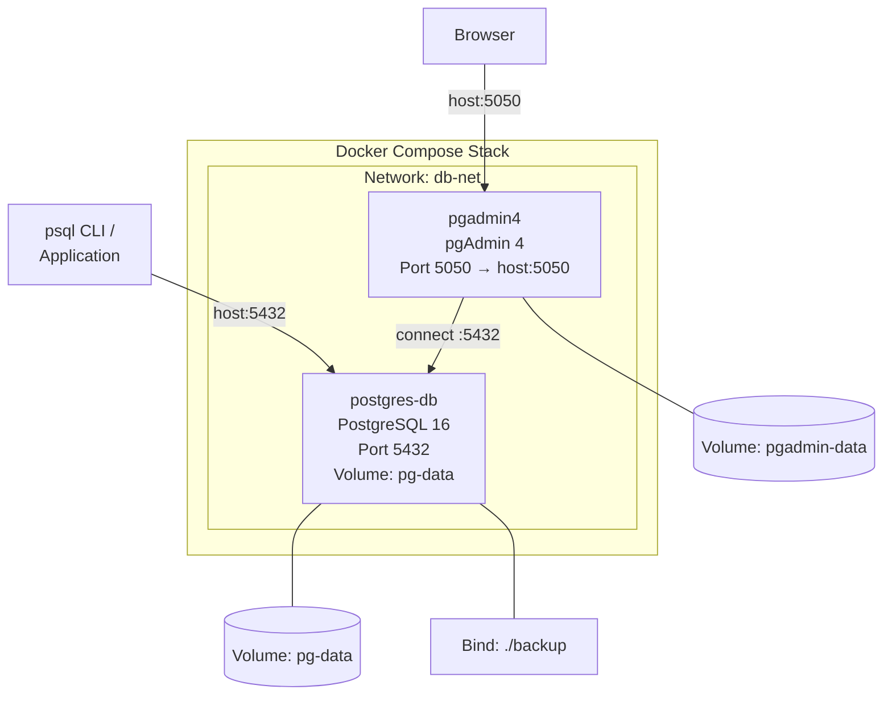

# MODUL 4: Database Service di Docker — PostgreSQL

**Topik:** Deployment PostgreSQL di Docker, Konfigurasi, Backup/Restore, Replikasi, dan Administrasi  
**Durasi:** 120 menit  
**Prasyarat:** Modul 3 selesai (memahami Docker Compose multi-container dan volume)

---

## 1. TUJUAN PEMBELAJARAN

Setelah praktikum ini, mahasiswa mampu:

1. Men-deploy PostgreSQL sebagai container Docker dengan konfigurasi production-grade
2. Melakukan inisialisasi database otomatis menggunakan init script
3. Mengelola data persistent PostgreSQL dengan Docker Volume
4. Melakukan backup dan restore database di container (pg_dump / pg_restore)
5. Mengkonfigurasi PostgreSQL: authentication (pg_hba.conf), tuning (postgresql.conf)
6. Menggunakan pgAdmin4 sebagai GUI database management dalam container
7. Membuat skema database, tabel, index, dan menjalankan query SQL
8. Menerapkan health check dan monitoring dasar PostgreSQL

---

## 2. DASAR TEORI

### 2.1 PostgreSQL Overview

PostgreSQL adalah Relational Database Management System (RDBMS) open-source yang dikenal dengan keandalan, fitur lengkap, dan compliance terhadap standar SQL. PostgreSQL mendukung ACID transactions, JSON/JSONB, full-text search, partitioning, dan extensibility melalui extension.

### 2.2 PostgreSQL di Docker

Image resmi `postgres` di Docker Hub menyediakan mekanisme konfigurasi melalui environment variable dan init script:

| Environment Variable | Fungsi |
|---|---|
| `POSTGRES_DB` | Nama database yang dibuat saat pertama kali start |
| `POSTGRES_USER` | Username superuser (default: `postgres`) |
| `POSTGRES_PASSWORD` | Password superuser (**wajib**) |
| `POSTGRES_INITDB_ARGS` | Argumen tambahan untuk `initdb` |
| `PGDATA` | Lokasi data directory (default: `/var/lib/postgresql/data`) |

**Init Script:** File `.sql` atau `.sh` yang ditempatkan di `/docker-entrypoint-initdb.d/` akan dieksekusi secara otomatis **hanya saat pertama kali** container dibuat (volume kosong).

### 2.3 Data Persistence

```
Container: postgres
┌─────────────────────────────┐
│  /var/lib/postgresql/data   │ ← PGDATA
│  (tablespace, WAL, config)  │
└───────────┬─────────────────┘
            │ Volume Mount
┌───────────▼─────────────────┐
│  Docker Volume: pg-data     │
│  Host: /var/lib/docker/     │
│        volumes/pg-data/_data│
└─────────────────────────────┘
```

---

## 3. TOPOLOGI LAB



---

## 4. LANGKAH PRAKTIKUM

### Langkah 0: Persiapan Project

```bash
mkdir -p ~/docker-lab/postgresql/{init,config,backup}
cd ~/docker-lab/postgresql
```

---

### Langkah 1: Deploy PostgreSQL dengan Docker Compose

#### 1.1 Buat init script (dijalankan saat pertama kali)

```bash
cat > init/01-create-schema.sql << 'EOF'
-- ==============================================
-- Init Script: Database Schema untuk Lab PENS
-- Dijalankan otomatis saat container pertama kali start
-- ==============================================

-- Buat database tambahan
CREATE DATABASE inventory_db;

-- Gunakan database utama (labdb sudah dibuat via env)
\c labdb

-- Buat schema
CREATE SCHEMA IF NOT EXISTS app;

-- Tabel: Mahasiswa
CREATE TABLE app.mahasiswa (
    id SERIAL PRIMARY KEY,
    nrp VARCHAR(15) UNIQUE NOT NULL,
    nama VARCHAR(100) NOT NULL,
    kelas CHAR(1) CHECK (kelas IN ('A', 'B', 'C', 'D')),
    kelompok INTEGER CHECK (kelompok BETWEEN 1 AND 10),
    email VARCHAR(100),
    created_at TIMESTAMP DEFAULT CURRENT_TIMESTAMP
);

-- Tabel: Mata Kuliah
CREATE TABLE app.matakuliah (
    id SERIAL PRIMARY KEY,
    kode VARCHAR(10) UNIQUE NOT NULL,
    nama VARCHAR(100) NOT NULL,
    sks INTEGER CHECK (sks BETWEEN 1 AND 6)
);

-- Tabel: Nilai (relasi many-to-many)
CREATE TABLE app.nilai (
    id SERIAL PRIMARY KEY,
    mahasiswa_id INTEGER REFERENCES app.mahasiswa(id) ON DELETE CASCADE,
    matakuliah_id INTEGER REFERENCES app.matakuliah(id) ON DELETE CASCADE,
    nilai_angka NUMERIC(5,2) CHECK (nilai_angka BETWEEN 0 AND 100),
    grade CHAR(2),
    semester VARCHAR(10),
    UNIQUE(mahasiswa_id, matakuliah_id, semester)
);

-- Tabel: Log Aktivitas (untuk Modul 5 logging)
CREATE TABLE app.activity_log (
    id BIGSERIAL PRIMARY KEY,
    timestamp TIMESTAMP DEFAULT CURRENT_TIMESTAMP,
    level VARCHAR(10) DEFAULT 'INFO',
    source VARCHAR(50),
    message TEXT,
    metadata JSONB
);

-- Index untuk performa query
CREATE INDEX idx_mahasiswa_kelas ON app.mahasiswa(kelas);
CREATE INDEX idx_mahasiswa_nrp ON app.mahasiswa(nrp);
CREATE INDEX idx_nilai_semester ON app.nilai(semester);
CREATE INDEX idx_activity_log_timestamp ON app.activity_log(timestamp);
CREATE INDEX idx_activity_log_level ON app.activity_log(level);
CREATE INDEX idx_activity_log_metadata ON app.activity_log USING GIN(metadata);

-- Insert sample data
INSERT INTO app.matakuliah (kode, nama, sks) VALUES
    ('JAR01', 'Administrasi Jaringan', 3),
    ('SBD01', 'Sistem Basis Data', 3),
    ('SO01',  'Sistem Operasi', 2),
    ('WEB01', 'Pemrograman Web', 3);

INSERT INTO app.mahasiswa (nrp, nama, kelas, kelompok, email) VALUES
    ('3122600001', 'Ahmad Fauzi', 'A', 1, 'ahmad@student.pens.ac.id'),
    ('3122600002', 'Budi Santoso', 'A', 1, 'budi@student.pens.ac.id'),
    ('3122600003', 'Citra Dewi', 'B', 2, 'citra@student.pens.ac.id'),
    ('3122600004', 'Dian Pratama', 'B', 2, 'dian@student.pens.ac.id'),
    ('3122600005', 'Eka Putra', 'C', 3, 'eka@student.pens.ac.id');

INSERT INTO app.nilai (mahasiswa_id, matakuliah_id, nilai_angka, grade, semester) VALUES
    (1, 1, 85.50, 'A', '2025-1'),
    (1, 2, 78.00, 'B+', '2025-1'),
    (2, 1, 92.00, 'A', '2025-1'),
    (3, 1, 70.25, 'B', '2025-1'),
    (4, 3, 88.75, 'A', '2025-1');

-- Buat read-only user untuk aplikasi
CREATE USER app_reader WITH PASSWORD 'reader123';
GRANT USAGE ON SCHEMA app TO app_reader;
GRANT SELECT ON ALL TABLES IN SCHEMA app TO app_reader;
ALTER DEFAULT PRIVILEGES IN SCHEMA app GRANT SELECT ON TABLES TO app_reader;

RAISE NOTICE 'Database initialization completed successfully!';
EOF
```

#### 1.2 Buat custom PostgreSQL config

```bash
cat > config/custom-postgresql.conf << 'EOF'
# ==============================================
# Custom PostgreSQL Configuration untuk Lab
# ==============================================

# Connection
listen_addresses = '*'
max_connections = 50

# Memory (sesuaikan untuk container dengan RAM terbatas)
shared_buffers = 128MB
work_mem = 4MB
maintenance_work_mem = 64MB
effective_cache_size = 256MB

# WAL & Checkpoint
wal_level = replica
max_wal_size = 256MB
min_wal_size = 64MB

# Logging
logging_collector = on
log_directory = '/var/log/postgresql'
log_filename = 'postgresql-%Y-%m-%d.log'
log_statement = 'mod'
log_min_duration_statement = 1000
log_connections = on
log_disconnections = on
log_line_prefix = '%t [%p] %u@%d '

# Locale & Timezone
timezone = 'Asia/Jakarta'
log_timezone = 'Asia/Jakarta'
EOF
```

#### 1.3 Buat Docker Compose

```bash
cat > docker-compose.yml << 'EOF'
services:
  # --- PostgreSQL 16 ---
  db:
    image: postgres:16-alpine
    container_name: postgres-db
    environment:
      POSTGRES_DB: labdb
      POSTGRES_USER: labuser
      POSTGRES_PASSWORD: labpass123
      TZ: Asia/Jakarta
    ports:
      - "5432:5432"
    volumes:
      - pg-data:/var/lib/postgresql/data
      - ./init:/docker-entrypoint-initdb.d:ro
      - ./config/custom-postgresql.conf:/etc/postgresql/custom.conf:ro
      - ./backup:/backup
      - pg-logs:/var/log/postgresql
    command: >
      postgres
        -c config_file=/etc/postgresql/custom.conf
        -c hba_file=/var/lib/postgresql/data/pg_hba.conf
    networks:
      - db-net
    healthcheck:
      test: ["CMD-SHELL", "pg_isready -U labuser -d labdb"]
      interval: 10s
      timeout: 5s
      retries: 5
    restart: unless-stopped

  # --- pgAdmin 4 (GUI) ---
  pgadmin:
    image: dpage/pgadmin4:latest
    container_name: pgadmin4
    environment:
      PGADMIN_DEFAULT_EMAIL: admin@pens.ac.id
      PGADMIN_DEFAULT_PASSWORD: admin123
      PGADMIN_LISTEN_PORT: 5050
    ports:
      - "5050:5050"
    volumes:
      - pgadmin-data:/var/lib/pgadmin
    networks:
      - db-net
    depends_on:
      db:
        condition: service_healthy
    restart: unless-stopped

volumes:
  pg-data:
  pg-logs:
  pgadmin-data:

networks:
  db-net:
EOF
```

#### 1.4 Deploy

```bash
docker compose up -d
docker compose ps

# Tunggu hingga healthcheck pass
docker compose logs db | tail -20
```

---

### Langkah 2: Koneksi dan Verifikasi Database

#### 2.1 Koneksi via psql dari host

```bash
# Install psql client (jika belum)
sudo apt install -y postgresql-client

# Koneksi ke database
psql -h localhost -U labuser -d labdb

# Di dalam psql:
\l                          -- list databases
\dn                         -- list schemas
\dt app.*                   -- list tabel di schema app
\d+ app.mahasiswa           -- describe tabel mahasiswa
SELECT * FROM app.mahasiswa;
SELECT * FROM app.matakuliah;
\q                          -- keluar
```

#### 2.2 Koneksi via docker exec

```bash
# Masuk ke psql di dalam container
docker exec -it postgres-db psql -U labuser -d labdb

# Query join: Nilai mahasiswa
SELECT m.nrp, m.nama, mk.nama AS matakuliah, n.nilai_angka, n.grade
FROM app.nilai n
JOIN app.mahasiswa m ON n.mahasiswa_id = m.id
JOIN app.matakuliah mk ON n.matakuliah_id = mk.id
ORDER BY m.nrp, mk.nama;

\q
```

#### 2.3 Koneksi via pgAdmin4

1. Buka browser: `http://localhost:5050`
2. Login: `admin@pens.ac.id` / `admin123`
3. **Add New Server:**
   - Name: `Lab PostgreSQL`
   - Host: `db` (nama service di Docker Compose)
   - Port: `5432`
   - Database: `labdb`
   - Username: `labuser`
   - Password: `labpass123`
4. Navigate: Servers → Lab PostgreSQL → Databases → labdb → Schemas → app → Tables
5. Klik kanan tabel `mahasiswa` → **View/Edit Data → All Rows**

---

### Langkah 3: Operasi CRUD SQL

```bash
docker exec -it postgres-db psql -U labuser -d labdb << 'SQLEOF'

-- === CREATE ===
INSERT INTO app.mahasiswa (nrp, nama, kelas, kelompok, email)
VALUES ('3122600010', 'Fajar Rizki', 'D', 5, 'fajar@student.pens.ac.id');

-- === READ ===
-- Semua mahasiswa kelas A
SELECT * FROM app.mahasiswa WHERE kelas = 'A';

-- Rata-rata nilai per matakuliah
SELECT mk.nama, AVG(n.nilai_angka)::NUMERIC(5,2) AS rata_rata, COUNT(*) AS jumlah
FROM app.nilai n
JOIN app.matakuliah mk ON n.matakuliah_id = mk.id
GROUP BY mk.nama
ORDER BY rata_rata DESC;

-- === UPDATE ===
UPDATE app.mahasiswa SET email = 'fajar.rizki@student.pens.ac.id'
WHERE nrp = '3122600010';

-- === DELETE ===
DELETE FROM app.mahasiswa WHERE nrp = '3122600010';

-- === JSONB query (untuk tabel activity_log) ===
INSERT INTO app.activity_log (level, source, message, metadata)
VALUES ('INFO', 'web-app', 'User login', '{"user": "admin", "ip": "192.168.1.10"}');

SELECT * FROM app.activity_log
WHERE metadata->>'user' = 'admin';

SQLEOF
```

---

### Langkah 4: Backup dan Restore

#### 4.1 Backup database (pg_dump)

```bash
# Backup dalam format custom (compressed, restorable)
docker exec postgres-db pg_dump -U labuser -d labdb -Fc \
    -f /backup/labdb_backup.dump

# Backup dalam format SQL plain text
docker exec postgres-db pg_dump -U labuser -d labdb \
    -f /backup/labdb_backup.sql

# Backup hanya schema app
docker exec postgres-db pg_dump -U labuser -d labdb -n app -Fc \
    -f /backup/labdb_schema_app.dump

# Verifikasi file backup di host
ls -la backup/
```

#### 4.2 Restore database

```bash
# Buat database baru untuk restore test
docker exec postgres-db psql -U labuser -d postgres -c "CREATE DATABASE labdb_restore;"

# Restore dari custom format
docker exec postgres-db pg_restore -U labuser -d labdb_restore \
    /backup/labdb_backup.dump

# Verifikasi restore
docker exec postgres-db psql -U labuser -d labdb_restore -c "SELECT * FROM app.mahasiswa;"
```

#### 4.3 Backup otomatis dengan cron di container

```bash
# Buat script backup
cat > backup/auto-backup.sh << 'BASH'
#!/bin/sh
TIMESTAMP=$(date +%Y%m%d_%H%M%S)
BACKUP_FILE="/backup/labdb_${TIMESTAMP}.dump"
pg_dump -U labuser -d labdb -Fc -f "$BACKUP_FILE"
echo "[$(date)] Backup created: $BACKUP_FILE"

# Hapus backup lebih dari 7 hari
find /backup -name "labdb_*.dump" -mtime +7 -delete
BASH
chmod +x backup/auto-backup.sh

# Test jalankan manual
docker exec postgres-db /backup/auto-backup.sh
ls -la backup/
```

---

### Langkah 5: Monitoring PostgreSQL

#### 5.1 Statistik database

```bash
docker exec -it postgres-db psql -U labuser -d labdb << 'SQLEOF'

-- Ukuran database
SELECT pg_database.datname,
       pg_size_pretty(pg_database_size(pg_database.datname)) AS size
FROM pg_database ORDER BY pg_database_size(pg_database.datname) DESC;

-- Ukuran per tabel
SELECT schemaname || '.' || tablename AS table_full,
       pg_size_pretty(pg_total_relation_size(schemaname || '.' || tablename)) AS total_size
FROM pg_tables WHERE schemaname = 'app'
ORDER BY pg_total_relation_size(schemaname || '.' || tablename) DESC;

-- Koneksi aktif
SELECT pid, usename, datname, client_addr, state, query_start, query
FROM pg_stat_activity WHERE datname = 'labdb';

-- Statistik tabel (hits, reads, cache ratio)
SELECT relname,
       seq_scan, seq_tup_read,
       idx_scan, idx_tup_fetch,
       n_tup_ins, n_tup_upd, n_tup_del
FROM pg_stat_user_tables WHERE schemaname = 'app';

SQLEOF
```

#### 5.2 Cek PostgreSQL log

```bash
# Lihat log PostgreSQL
docker exec postgres-db ls /var/log/postgresql/
docker exec postgres-db cat /var/log/postgresql/postgresql-$(date +%Y-%m-%d).log | tail -30
```

---

## 5. PERTANYAAN

### Pre-Lab

1. Apa fungsi file/folder `/docker-entrypoint-initdb.d/` di image PostgreSQL?
2. Mengapa `POSTGRES_PASSWORD` wajib diset? Apa risikonya jika tidak ada password?
3. Jelaskan perbedaan antara `pg_dump` format custom (`-Fc`) dan format SQL plain text.
4. Apa itu `shared_buffers` dan mengapa perlu disesuaikan untuk container?
5. Mengapa data PostgreSQL harus disimpan di Docker Volume, bukan di container layer?

### Post-Lab

1. Jalankan `docker compose down` lalu `docker compose up -d`. Apakah data mahasiswa masih ada? Buktikan.
2. Jalankan `docker compose down -v` lalu `docker compose up -d`. Apa yang terjadi? Apakah init script dijalankan ulang?
3. Bandingkan ukuran file backup format custom vs SQL. Mana yang lebih kecil dan mengapa?
4. Buat query yang menampilkan mahasiswa yang belum memiliki nilai di semester apapun.
5. Jelaskan peran user `app_reader` yang dibuat di init script. Apa bedanya dengan `labuser`?

---

## 6. CHECKLIST

- [ ] PostgreSQL container running dan healthy — `docker compose ps`
- [ ] Init script berhasil — tabel di schema `app` ada
- [ ] `psql` dari host bisa connect — `psql -h localhost -U labuser -d labdb`
- [ ] pgAdmin4 bisa diakses di `http://localhost:5050` dan connect ke database
- [ ] Query CRUD berhasil — INSERT, SELECT, UPDATE, DELETE
- [ ] Backup berhasil — file `.dump` dan `.sql` ada di `./backup/`
- [ ] Restore berhasil — data bisa dibaca di database `labdb_restore`
- [ ] Data persist — setelah `docker compose down` + `up`, data masih ada
- [ ] Monitoring query berfungsi — `pg_stat_activity`, `pg_database_size`
- [ ] Log PostgreSQL bisa dibaca di `/var/log/postgresql/`

---

## 7. TABEL TROUBLESHOOTING

| **Gejala** | **Kemungkinan Cause** | **Solusi** |
|---|---|---|
| `FATAL: role "labuser" does not exist` | Init belum selesai atau env salah | Cek `POSTGRES_USER` di compose, tunggu healthcheck pass |
| Init script tidak jalan | Volume sudah ada data (bukan pertama kali) | `docker compose down -v` lalu `up` ulang |
| `psql: connection refused` | Port belum mapping atau container down | Cek `docker compose ps`, pastikan port `5432:5432` |
| pgAdmin tidak bisa connect | Hostname salah (pakai `localhost` bukan `db`) | Di pgAdmin, hostname = `db` (nama service Compose) |
| `FATAL: password authentication failed` | Password salah | Cek `POSTGRES_PASSWORD` di compose, gunakan password yang sama |
| Backup file kosong (0 bytes) | Database name salah di `pg_dump` | Pastikan `-d labdb` sesuai |
| Custom config tidak dipakai | Path `-c config_file=` salah | Cek volume mount dan path di `command:` |
| Disk full di container | WAL files menumpuk | Set `max_wal_size` lebih kecil, jalankan `CHECKPOINT` |
| Query lambat | Tidak ada index atau `shared_buffers` kecil | Buat index, tune `shared_buffers` di config |
| Container restart loop | Config syntax error | `docker compose logs db`, fix config, `up` ulang |

---

## 8. FORMAT LAPORAN

Submit via LMS dalam **satu file PDF (max 6 halaman)**:

**Halaman 1:** Cover

**Halaman 2–4:** Screenshot Wajib (10 screenshot):
1. `docker compose ps` — db dan pgadmin running + healthy
2. `psql` connect + `\dt app.*` — list tabel
3. `SELECT * FROM app.mahasiswa` — data sample
4. Query JOIN nilai — output tabel gabungan
5. pgAdmin4 login + server connection
6. pgAdmin4 — tabel view/edit data
7. `pg_dump` output — backup file terbuat
8. `pg_restore` + SELECT — data berhasil di-restore
9. `pg_stat_activity` — koneksi aktif
10. PostgreSQL log — isi log file

**Halaman 5–6:** Jawaban Post-Lab

---

## 9. REFERENSI

1. The PostgreSQL Global Development Group. (2025). PostgreSQL 16 Documentation. https://www.postgresql.org/docs/16/
2. Docker, Inc. (2025). Docker Hub — Official postgres Image. https://hub.docker.com/_/postgres
3. pgAdmin Development Team. (2025). pgAdmin 4 Documentation. https://www.pgadmin.org/docs/
4. The PostgreSQL Global Development Group. (2025). pg_dump. https://www.postgresql.org/docs/16/app-pgdump.html
5. The PostgreSQL Global Development Group. (2025). Server Configuration. https://www.postgresql.org/docs/16/runtime-config.html

---

> **Durasi:** 120 menit | **Difficulty:** Intermediate  
> **Previous:** Modul 3 — Web Service di Docker (Apache & Nginx)  
> **Next:** Modul 5 — Logging Service Docker dengan PostgreSQL
