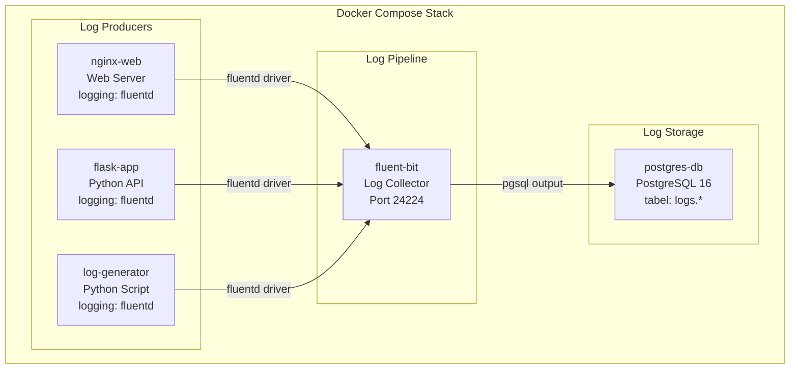

# MODUL 5: Logging Service Docker dengan PostgreSQL

**Topik:** Centralized Logging dengan Fluentd/Fluent Bit, PostgreSQL sebagai Log Storage, dan Log Analysis  
**Durasi:** 120 menit  
**Prasyarat:** Modul 4 selesai (PostgreSQL running di Docker, tabel `activity_log` sudah ada)

---

## 1. TUJUAN PEMBELAJARAN

Setelah praktikum ini, mahasiswa mampu:

1. Memahami arsitektur centralized logging di lingkungan container
2. Men-deploy Fluent Bit sebagai log collector dan forwarder dalam Docker
3. Mengkonfigurasi Docker logging driver untuk mengirim log ke Fluent Bit
4. Menyimpan log dari semua container ke PostgreSQL secara terpusat
5. Membuat Python log generator untuk mensimulasikan log aplikasi
6. Melakukan query dan analisis log menggunakan SQL di PostgreSQL
7. Mengimplementasikan log rotation dan retention policy
8. Mengorkestrasi seluruh stack logging dengan Docker Compose

---

## 2. DASAR TEORI

### 2.1 Pentingnya Centralized Logging

Di lingkungan container, service bisa berjumlah banyak dan bersifat ephemeral (dibuat dan dihapus secara dinamis). Log tersebar di masing-masing container menyulitkan debugging dan audit. **Centralized logging** mengumpulkan semua log ke satu tempat, memudahkan pencarian, analisis, dan alerting.

### 2.2 Arsitektur Logging

```
┌───────────────┐  ┌───────────────┐  ┌───────────────┐
│  Container A  │  │  Container B  │  │  Container C  │
│  (web server) │  │  (flask app)  │  │  (worker)     │
│  stdout/stderr│  │  stdout/stderr│  │  stdout/stderr│
└───────┬───────┘  └───────┬───────┘  └───────┬───────┘
        │                  │                  │
        └──────────────────┼──────────────────┘
                           │ Docker Fluentd
                           │ logging driver
                    ┌──────▼──────┐
                    │  Fluent Bit │
                    │  (Collector │
                    │  & Parser)  │
                    └──────┬──────┘
                           │ SQL INSERT
                    ┌──────▼──────┐
                    │ PostgreSQL  │
                    │ (Log Store) │
                    └─────────────┘
```

### 2.3 Fluent Bit vs Fluentd

| Aspek | Fluent Bit | Fluentd |
|---|---|---|
| Bahasa | C | Ruby + C |
| Memory | ~1 MB | ~40 MB |
| Plugin | Built-in essentials | 1000+ plugin ecosystem |
| Use Case | Edge/sidecar collector | Aggregator/forwarder |
| Docker Image | `fluent/fluent-bit` | `fluent/fluentd` |

Praktikum ini menggunakan **Fluent Bit** karena ringan dan cocok untuk skenario lab.

### 2.4 Docker Logging Driver

Docker mendukung beberapa logging driver. Default-nya adalah `json-file` yang menyimpan log ke file JSON di host. Untuk centralized logging, kita bisa menggunakan driver `fluentd` yang mengirim log langsung ke Fluent Bit/Fluentd.

| Driver | Deskripsi |
|---|---|
| `json-file` | Default, simpan ke file JSON |
| `syslog` | Kirim ke syslog daemon |
| `fluentd` | Kirim ke Fluentd/Fluent Bit |
| `journald` | Kirim ke systemd journal |
| `none` | Buang semua log |

---

## 3. TOPOLOGI LAB



---

## 4. LANGKAH PRAKTIKUM

### Langkah 0: Persiapan Project

```bash
mkdir -p ~/docker-lab/logging/{fluent-bit,app,generator,init}
cd ~/docker-lab/logging
```

---

### Langkah 1: Buat Database Schema untuk Logging

```bash
cat > init/01-logging-schema.sql << 'EOF'
-- ==============================================
-- Schema untuk Centralized Logging
-- ==============================================

CREATE SCHEMA IF NOT EXISTS logs;

-- Tabel utama: menyimpan semua log dari container
CREATE TABLE logs.container_logs (
    id BIGSERIAL PRIMARY KEY,
    received_at TIMESTAMP DEFAULT CURRENT_TIMESTAMP,
    timestamp TIMESTAMP,
    container_name VARCHAR(100),
    container_id VARCHAR(64),
    source VARCHAR(10),           -- stdout / stderr
    log_level VARCHAR(10),
    message TEXT,
    raw_log TEXT,
    metadata JSONB DEFAULT '{}'
);

-- Tabel: summary per container per jam (untuk dashboard)
CREATE TABLE logs.hourly_summary (
    id SERIAL PRIMARY KEY,
    hour TIMESTAMP NOT NULL,
    container_name VARCHAR(100),
    total_logs INTEGER DEFAULT 0,
    error_count INTEGER DEFAULT 0,
    warn_count INTEGER DEFAULT 0,
    info_count INTEGER DEFAULT 0,
    UNIQUE(hour, container_name)
);

-- Index untuk performa query
CREATE INDEX idx_logs_timestamp ON logs.container_logs(timestamp);
CREATE INDEX idx_logs_container ON logs.container_logs(container_name);
CREATE INDEX idx_logs_level ON logs.container_logs(log_level);
CREATE INDEX idx_logs_received ON logs.container_logs(received_at);
CREATE INDEX idx_logs_metadata ON logs.container_logs USING GIN(metadata);
CREATE INDEX idx_summary_hour ON logs.hourly_summary(hour);

-- Fungsi: auto-cleanup log > 30 hari
CREATE OR REPLACE FUNCTION logs.cleanup_old_logs()
RETURNS INTEGER AS $$
DECLARE
    deleted_count INTEGER;
BEGIN
    DELETE FROM logs.container_logs
    WHERE received_at < NOW() - INTERVAL '30 days';
    GET DIAGNOSTICS deleted_count = ROW_COUNT;
    RETURN deleted_count;
END;
$$ LANGUAGE plpgsql;

-- View: log terbaru dengan format readable
CREATE VIEW logs.recent_logs AS
SELECT
    id,
    to_char(timestamp, 'YYYY-MM-DD HH24:MI:SS') AS time,
    container_name AS container,
    log_level AS level,
    LEFT(message, 200) AS message_preview
FROM logs.container_logs
ORDER BY timestamp DESC
LIMIT 100;

-- View: error summary per container
CREATE VIEW logs.error_summary AS
SELECT
    container_name,
    log_level,
    COUNT(*) AS count,
    MAX(timestamp) AS last_seen
FROM logs.container_logs
WHERE log_level IN ('ERROR', 'WARN', 'CRITICAL')
GROUP BY container_name, log_level
ORDER BY count DESC;

RAISE NOTICE 'Logging schema created successfully!';
EOF
```

---

### Langkah 2: Konfigurasi Fluent Bit

```bash
cat > fluent-bit/fluent-bit.conf << 'EOF'
[SERVICE]
    Flush        5
    Daemon       Off
    Log_Level    info
    Parsers_File parsers.conf

[INPUT]
    Name         forward
    Listen       0.0.0.0
    Port         24224
    Tag          docker.*

[FILTER]
    Name         parser
    Match        docker.*
    Key_Name     log
    Parser       docker_json
    Reserve_Data On

[FILTER]
    Name         modify
    Match        docker.*
    Rename       log message
    Rename       container_name source_container

[OUTPUT]
    Name         pgsql
    Match        docker.*
    Host         postgres-db
    Port         5432
    User         labuser
    Password     labpass123
    Database     labdb
    Table        container_logs
    Schema       logs
    Timestamp_Key timestamp
    Async        false
    min_pool_size 1
    max_pool_size 4

[OUTPUT]
    Name         stdout
    Match        docker.*
    Format       json_lines
EOF

cat > fluent-bit/parsers.conf << 'EOF'
[PARSER]
    Name         docker_json
    Format       json
    Time_Key     time
    Time_Format  %Y-%m-%dT%H:%M:%S.%L
    Time_Keep    On

[PARSER]
    Name         python_log
    Format       regex
    Regex        ^(?<timestamp>[^ ]+ [^ ]+) (?<level>[A-Z]+) +(?<message>.*)$
    Time_Key     timestamp
    Time_Format  %Y-%m-%d %H:%M:%S,%L
EOF
```

---

### Langkah 3: Buat Log Generator (Simulasi Multi-Level Log)

```bash
cat > generator/generator.py << 'PYEOF'
"""
Log Generator — mensimulasikan log dari aplikasi production.
Menghasilkan log dengan berbagai level: DEBUG, INFO, WARN, ERROR, CRITICAL.
"""
import json, time, random, socket, datetime, sys, os

HOSTNAME = socket.gethostname()
LOG_INTERVAL = float(os.environ.get("LOG_INTERVAL", "2"))

# Simulasi event dengan bobot probabilitas
EVENTS = [
    {"level": "INFO",     "weight": 50, "messages": [
        "User login successful",
        "Page /dashboard loaded in {ms}ms",
        "API request GET /api/users completed",
        "Session created for user_{uid}",
        "Cache hit for key: product_{pid}",
        "Health check passed",
        "Background job completed: email_send"
    ]},
    {"level": "DEBUG",    "weight": 20, "messages": [
        "Database query executed in {ms}ms",
        "Redis connection pool: {pool} active",
        "Request headers: content-type=application/json",
        "Middleware chain completed in {ms}ms"
    ]},
    {"level": "WARN",     "weight": 15, "messages": [
        "Slow query detected: {ms}ms (threshold: 1000ms)",
        "Memory usage at {mem}% — approaching limit",
        "Rate limit approaching for IP 192.168.{ip}.{host}",
        "Deprecated API endpoint called: /api/v1/legacy",
        "Certificate expires in {days} days"
    ]},
    {"level": "ERROR",    "weight": 10, "messages": [
        "Failed to connect to database: timeout after 5s",
        "NullPointerException in UserService.getProfile()",
        "HTTP 500 Internal Server Error on /api/checkout",
        "Disk write failed: /var/log/app.log — Permission denied",
        "Payment gateway returned error code {code}"
    ]},
    {"level": "CRITICAL", "weight": 5,  "messages": [
        "Database connection pool exhausted — all {pool} connections in use",
        "Out of memory: container killed by OOM",
        "SSL certificate EXPIRED — HTTPS unavailable",
        "Data corruption detected in table: orders"
    ]}
]

def weighted_choice():
    total = sum(e["weight"] for e in EVENTS)
    r = random.uniform(0, total)
    cumulative = 0
    for event in EVENTS:
        cumulative += event["weight"]
        if r <= cumulative:
            return event
    return EVENTS[0]

def generate_log():
    event = weighted_choice()
    msg = random.choice(event["messages"])
    msg = msg.format(
        ms=random.randint(5, 3000),
        uid=random.randint(1000, 9999),
        pid=random.randint(1, 500),
        pool=random.randint(1, 50),
        mem=random.randint(60, 98),
        ip=random.randint(1, 254),
        host=random.randint(1, 254),
        days=random.randint(1, 30),
        code=random.choice([400, 401, 403, 500, 502, 503])
    )

    log_entry = {
        "timestamp": datetime.datetime.now().isoformat(),
        "level": event["level"],
        "hostname": HOSTNAME,
        "service": "log-generator",
        "message": msg,
        "request_id": f"req-{random.randint(100000, 999999)}"
    }

    # Output sebagai JSON ke stdout → Docker logging driver menangkap
    print(json.dumps(log_entry), flush=True)

if __name__ == "__main__":
    print(json.dumps({
        "timestamp": datetime.datetime.now().isoformat(),
        "level": "INFO",
        "message": f"Log generator started on {HOSTNAME}, interval={LOG_INTERVAL}s"
    }), flush=True)

    while True:
        generate_log()
        time.sleep(LOG_INTERVAL + random.uniform(-0.5, 0.5))
PYEOF

cat > generator/Dockerfile << 'EOF'
FROM python:3.11-alpine
WORKDIR /app
COPY generator.py .
CMD ["python", "-u", "generator.py"]
EOF
```

---

### Langkah 4: Buat Flask App dengan Structured Logging

```bash
cat > app/requirements.txt << 'EOF'
flask==3.1.*
psycopg2-binary==2.9.*
EOF

cat > app/app.py << 'PYEOF'
import os, json, socket, datetime, logging, sys
from flask import Flask, jsonify, request
import psycopg2

app = Flask(__name__)

# Structured JSON logging ke stdout
class JSONFormatter(logging.Formatter):
    def format(self, record):
        return json.dumps({
            "timestamp": datetime.datetime.now().isoformat(),
            "level": record.levelname,
            "hostname": socket.gethostname(),
            "service": "flask-app",
            "message": record.getMessage(),
            "module": record.module
        })

handler = logging.StreamHandler(sys.stdout)
handler.setFormatter(JSONFormatter())
app.logger.handlers = [handler]
app.logger.setLevel(logging.INFO)

DB = dict(host=os.environ.get("DB_HOST","postgres-db"),
          dbname=os.environ.get("DB_NAME","labdb"),
          user=os.environ.get("DB_USER","labuser"),
          password=os.environ.get("DB_PASS","labpass123"))

@app.route("/")
def index():
    app.logger.info(f"Index accessed from {request.remote_addr}")
    return jsonify({"service": "flask-app", "status": "running"})

@app.route("/api/logs/stats")
def log_stats():
    """Query statistik log dari PostgreSQL"""
    try:
        conn = psycopg2.connect(**DB); cur = conn.cursor()
        cur.execute("""
            SELECT log_level, COUNT(*) as count
            FROM logs.container_logs
            WHERE received_at > NOW() - INTERVAL '1 hour'
            GROUP BY log_level ORDER BY count DESC
        """)
        stats = [{"level": r[0], "count": r[1]} for r in cur.fetchall()]
        cur.execute("SELECT COUNT(*) FROM logs.container_logs")
        total = cur.fetchone()[0]
        cur.close(); conn.close()
        return jsonify({"total_logs": total, "last_hour": stats})
    except Exception as e:
        app.logger.error(f"Failed to query log stats: {e}")
        return jsonify({"error": str(e)}), 500

@app.route("/api/logs/search")
def log_search():
    """Cari log berdasarkan keyword dan level"""
    keyword = request.args.get("q", "")
    level = request.args.get("level", "")
    limit = min(int(request.args.get("limit", 50)), 200)
    try:
        conn = psycopg2.connect(**DB); cur = conn.cursor()
        query = "SELECT id, timestamp, container_name, log_level, message FROM logs.container_logs WHERE 1=1"
        params = []
        if keyword:
            query += " AND message ILIKE %s"
            params.append(f"%{keyword}%")
        if level:
            query += " AND log_level = %s"
            params.append(level.upper())
        query += " ORDER BY timestamp DESC LIMIT %s"
        params.append(limit)
        cur.execute(query, params)
        logs = [{"id": r[0], "time": str(r[1]), "container": r[2],
                 "level": r[3], "message": r[4]} for r in cur.fetchall()]
        cur.close(); conn.close()
        return jsonify(logs)
    except Exception as e:
        return jsonify({"error": str(e)}), 500

if __name__ == "__main__":
    app.run(host="0.0.0.0", port=5000)
PYEOF

cat > app/Dockerfile << 'EOF'
FROM python:3.11-slim
WORKDIR /app
COPY requirements.txt .
RUN pip install --no-cache-dir -r requirements.txt
COPY app.py .
EXPOSE 5000
CMD ["python", "-u", "app.py"]
EOF
```

---

### Langkah 5: Docker Compose untuk Stack Logging

```bash
cat > docker-compose.yml << 'EOF'
services:
  # === Log Collector: Fluent Bit ===
  fluent-bit:
    image: fluent/fluent-bit:latest
    container_name: fluent-bit
    ports:
      - "24224:24224"
      - "24224:24224/udp"
    volumes:
      - ./fluent-bit/fluent-bit.conf:/fluent-bit/etc/fluent-bit.conf:ro
      - ./fluent-bit/parsers.conf:/fluent-bit/etc/parsers.conf:ro
    networks:
      - logging-net
    depends_on:
      postgres-db:
        condition: service_healthy
    restart: unless-stopped

  # === Log Storage: PostgreSQL ===
  postgres-db:
    image: postgres:16-alpine
    container_name: postgres-db
    environment:
      POSTGRES_DB: labdb
      POSTGRES_USER: labuser
      POSTGRES_PASSWORD: labpass123
      TZ: Asia/Jakarta
    ports:
      - "5432:5432"
    volumes:
      - pg-data:/var/lib/postgresql/data
      - ./init:/docker-entrypoint-initdb.d:ro
    networks:
      - logging-net
    healthcheck:
      test: ["CMD-SHELL", "pg_isready -U labuser -d labdb"]
      interval: 10s
      timeout: 5s
      retries: 5
    restart: unless-stopped

  # === Log Producer: Nginx ===
  nginx-web:
    image: nginx:alpine
    container_name: nginx-web
    ports:
      - "8080:80"
    networks:
      - logging-net
    logging:
      driver: fluentd
      options:
        fluentd-address: "localhost:24224"
        fluentd-async: "true"
        tag: "docker.nginx"
    depends_on:
      - fluent-bit
    restart: unless-stopped

  # === Log Producer: Flask App ===
  flask-app:
    build: ./app
    container_name: flask-app
    environment:
      - DB_HOST=postgres-db
      - DB_NAME=labdb
      - DB_USER=labuser
      - DB_PASS=labpass123
    ports:
      - "5000:5000"
    networks:
      - logging-net
    logging:
      driver: fluentd
      options:
        fluentd-address: "localhost:24224"
        fluentd-async: "true"
        tag: "docker.flask"
    depends_on:
      - fluent-bit
      - postgres-db
    restart: unless-stopped

  # === Log Producer: Generator ===
  log-generator:
    build: ./generator
    container_name: log-generator
    environment:
      - LOG_INTERVAL=3
    networks:
      - logging-net
    logging:
      driver: fluentd
      options:
        fluentd-address: "localhost:24224"
        fluentd-async: "true"
        tag: "docker.generator"
    depends_on:
      - fluent-bit
    restart: unless-stopped

volumes:
  pg-data:

networks:
  logging-net:
EOF
```

---

### Langkah 6: Deploy dan Verifikasi

#### 6.1 Build dan jalankan

```bash
docker compose up --build -d
docker compose ps

# Tunggu ~30 detik agar log terkumpul
sleep 30
```

#### 6.2 Generate traffic untuk Nginx

```bash
# Akses Nginx beberapa kali untuk generate access log
for i in $(seq 1 20); do curl -s http://localhost:8080 > /dev/null; done

# Akses Flask API
for i in $(seq 1 10); do curl -s http://localhost:5000/ > /dev/null; done
```

#### 6.3 Query log di PostgreSQL

```bash
docker exec -it postgres-db psql -U labuser -d labdb << 'SQLEOF'

-- Total log yang masuk
SELECT COUNT(*) AS total_logs FROM logs.container_logs;

-- Log terbaru (view)
SELECT * FROM logs.recent_logs LIMIT 10;

-- Distribusi log per container
SELECT container_name, COUNT(*) AS total
FROM logs.container_logs
GROUP BY container_name ORDER BY total DESC;

-- Distribusi per level
SELECT log_level, COUNT(*) AS total
FROM logs.container_logs
GROUP BY log_level ORDER BY total DESC;

-- Error summary (view)
SELECT * FROM logs.error_summary;

-- Cari log ERROR dalam 1 jam terakhir
SELECT timestamp, container_name, message
FROM logs.container_logs
WHERE log_level = 'ERROR'
AND received_at > NOW() - INTERVAL '1 hour'
ORDER BY timestamp DESC LIMIT 10;

-- Log rate per menit (5 menit terakhir)
SELECT
    date_trunc('minute', received_at) AS minute,
    COUNT(*) AS logs_per_minute
FROM logs.container_logs
WHERE received_at > NOW() - INTERVAL '5 minutes'
GROUP BY minute ORDER BY minute;

SQLEOF
```

#### 6.4 Gunakan API untuk query log

```bash
# Statistik log
curl http://localhost:5000/api/logs/stats | python3 -m json.tool

# Cari log dengan keyword "error"
curl "http://localhost:5000/api/logs/search?q=error&limit=5" | python3 -m json.tool

# Cari log level CRITICAL
curl "http://localhost:5000/api/logs/search?level=CRITICAL&limit=5" | python3 -m json.tool
```

#### 6.5 Log retention cleanup

```bash
# Jalankan fungsi cleanup manual
docker exec postgres-db psql -U labuser -d labdb -c \
    "SELECT logs.cleanup_old_logs() AS deleted_rows;"
```

---

## 5. PERTANYAAN

### Pre-Lab

1. Mengapa centralized logging penting di lingkungan container?
2. Apa perbedaan antara Docker logging driver `json-file` dan `fluentd`?
3. Jelaskan keuntungan menyimpan log di database (PostgreSQL) vs file text.
4. Apa itu structured logging dan mengapa lebih baik daripada plain text log?
5. Mengapa Fluent Bit lebih cocok untuk sidecar/edge collection dibanding Fluentd?

### Post-Lab

1. Berapa total log yang masuk ke PostgreSQL setelah 5 menit? Tunjukkan distribusi per container dan per level.
2. Tulis query SQL yang menampilkan log rate per menit selama 10 menit terakhir.
3. Apa yang terjadi jika container `fluent-bit` di-stop? Apakah container lain juga stop? Apakah log hilang?
4. Jelaskan alur sebuah log entry dari `log-generator` stdout sampai masuk ke tabel `container_logs`.
5. Modifikasi `LOG_INTERVAL` menjadi `0.5` detik. Berapa log rate per menit yang dihasilkan?

---

## 6. CHECKLIST

- [ ] PostgreSQL running + schema `logs` ada — `\dt logs.*`
- [ ] Fluent Bit running — `docker compose logs fluent-bit`
- [ ] 3 log producer running — nginx, flask, generator
- [ ] Log masuk ke PostgreSQL — `SELECT COUNT(*) FROM logs.container_logs` > 0
- [ ] Distribusi per container terlihat — 3 container name berbeda
- [ ] Query level ERROR menampilkan hasil
- [ ] API `/api/logs/stats` menampilkan statistik
- [ ] API `/api/logs/search?q=error` menampilkan hasil
- [ ] View `recent_logs` menampilkan log terbaru
- [ ] View `error_summary` menampilkan summary error

---

## 7. TABEL TROUBLESHOOTING

| **Gejala** | **Kemungkinan Cause** | **Solusi** |
|---|---|---|
| Container log producer gagal start | Fluent Bit belum ready | Pastikan `depends_on` ke `fluent-bit` dan Fluent Bit healthy |
| `docker compose logs` kosong | Logging driver = fluentd, bukan json-file | Log dikirim ke Fluent Bit, bukan ke file. Cek di PostgreSQL |
| Tabel `container_logs` kosong | Fluent Bit tidak connect ke PostgreSQL | Cek `docker compose logs fluent-bit`, pastikan host/port benar |
| Fluent Bit `connection refused` ke PostgreSQL | PostgreSQL belum ready | Pastikan healthcheck pass sebelum Fluent Bit start |
| `fluentd-address` error | Address salah (harus `localhost:24224` atau IP host) | Pastikan Fluent Bit port 24224 exposed ke host |
| Log generator terlalu banyak log | `LOG_INTERVAL` terlalu kecil | Naikkan interval di environment variable |
| PostgreSQL disk penuh | Log menumpuk tanpa cleanup | Jalankan `SELECT logs.cleanup_old_logs()` |
| API `/api/logs/stats` error 500 | Schema `logs` belum ada | Pastikan init script jalan (volume kosong saat pertama deploy) |

---

## 8. FORMAT LAPORAN

Submit via LMS dalam **satu file PDF (max 6 halaman)**:

**Halaman 1:** Cover

**Halaman 2–4:** Screenshot Wajib (10 screenshot):
1. `docker compose ps` — 5 service running
2. `docker compose logs fluent-bit` — Fluent Bit menerima log
3. `SELECT COUNT(*) FROM logs.container_logs` — jumlah total log
4. `SELECT * FROM logs.recent_logs LIMIT 10` — sample log terbaru
5. Query distribusi per container — output tabel
6. Query distribusi per level — output tabel
7. `SELECT * FROM logs.error_summary` — summary error
8. Query log rate per menit — output tabel
9. `curl /api/logs/stats` — response JSON
10. `curl /api/logs/search?q=error` — response JSON

**Halaman 5–6:** Jawaban Post-Lab

---

## 9. REFERENSI

1. Fluent Bit. (2025). Fluent Bit Official Documentation. https://docs.fluentbit.io/
2. Fluent Bit. (2025). PostgreSQL Output Plugin. https://docs.fluentbit.io/manual/pipeline/outputs/postgresql
3. Docker, Inc. (2025). Configure Logging Drivers. https://docs.docker.com/config/containers/logging/
4. Docker, Inc. (2025). Fluentd Logging Driver. https://docs.docker.com/config/containers/logging/fluentd/
5. The PostgreSQL Global Development Group. (2025). JSON Functions and Operators. https://www.postgresql.org/docs/16/functions-json.html

---

> **Durasi:** 120 menit | **Difficulty:** Intermediate–Advanced  
> **Previous:** Modul 4 — Database Service di Docker (PostgreSQL)  
> **Next:** Modul 6 — Grafana Service Docker untuk Monitoring Resource
